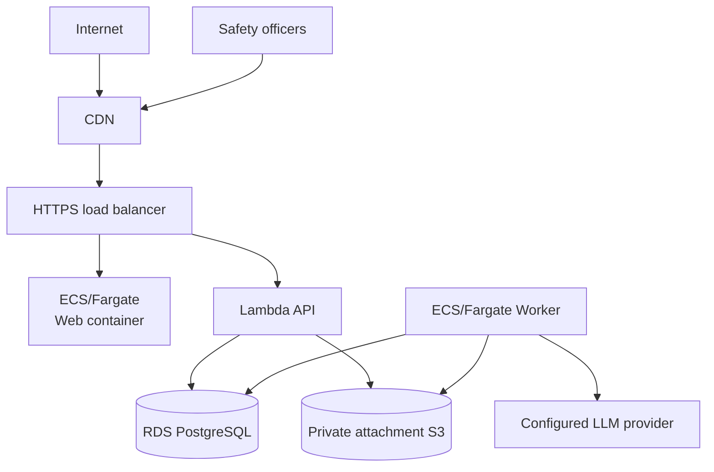

# Infrastructure and operations

## Production topology

**CON-INF-001** Production is one deliberately small AWS environment in `ca-central-1`.
*Verified by: none — an infrastructure property no application scenario can
observe; Terraform validation and the `infra` job are its check.*

The public form and the admin review queue are routes within one
React/TypeScript/Vite build, served by one Nginx ECS Fargate container behind
one CloudFront distribution
([ADR-0043](decisions/ADR-0043-react-typescript-vite-web-front-end.md),
[ADR-0044](decisions/ADR-0044-containerized-web-hosting.md),
[ADR-0048](decisions/ADR-0048-one-website-admin-as-a-route.md)). The API,
Worker, and the web site run from container images, on different primitives —
the API is a Lambda function (container image, behind the ALB via a Lambda
target group; see
[ADR-0042](decisions/ADR-0042-lambda-hosted-api-with-fargate-migration-path.md)),
the Worker and the web site each a separate ECS Fargate service. RDS and
attachment storage are private. Secrets Manager supplies runtime secrets.
Terraform owns the topology; EF Core migrations own schema changes, applied at
startup ([ADR-0055](decisions/ADR-0055-ef-core-migrations-sql-files-stored-procedures.md)).

**CON-INF-002** No SES/email resources, messaging integrations, public attachment distribution,
application encryption key, speculative queueing platform, or autoscaling
machinery is part of the target.
*Verified by: REQ-MOD-039 for the publication and messaging boundary; none for
the rest.* Existing infrastructure for those removed
features should be pruned when implementation aligns.

## Network and data protection

**CON-INF-003** Only the CloudFront distribution and the HTTPS ALB are public. The API
Lambda function, the web container, and Worker tasks are attached to private
subnets; security groups narrowly allow API/Worker to RDS and necessary
egress. S3 public access is blocked. Managed encryption is
enabled for RDS, snapshots/backups, logs, secrets, and every bucket. TLS is
required for browsers, the identity provider, AWS service access, database
connections, and the model provider.
*Verified by: none — an infrastructure property no application scenario can
observe; Terraform validation and the `infra` job are its check.*

A small deployment may use one NAT gateway and the relevant AWS endpoints to
control cost. Availability, backup retention, deletion protection, and final
snapshot behavior are explicit production variables, not assumptions hidden in
application code.

## Configuration and secrets

Configuration includes database/storage endpoints, attachment count and 50 MB size
limit, accepted attachment types, trusted proxy networks, the site origin,
rate limits, the authentication issuer, audience, and role-claim name,
model/prompt version, retry bounds, and stuck-work thresholds.

**CON-INF-004** There are no cookie settings, no Turnstile configuration, and no HPAC auth kill
switch or hardcoded endpoint. Sessions are bearer tokens, Turnstile is gone
([ADR-0068](decisions/ADR-0068-the-member-token-replaces-turnstile-on-submission.md)),
and this system never contacts a member login endpoint
([ADR-0064](decisions/ADR-0064-jwt-bearer-authentication-with-three-roles.md)).
*Verified by: REQ-SUB-018, REQ-MOD-003.*

**CON-INF-005** Secret values live in Secrets Manager and never in Terraform state, GitHub
variables, source, appsettings committed to the repository, logs, or task
definitions. Terraform creates secret containers/references; an authorized
operator supplies values out of band. The identity provider's client secret is
one of these. Two recorded exceptions are GitHub repository secrets passed to a
task as environment variables by the deploy workflow: DeepL's key
([ADR-0062](decisions/ADR-0062-administrators-may-machine-translate-question-text.md))
and the summarization provider's key, `AiChatClient__ApiKey`
([ADR-0104](decisions/ADR-0104-summaries-are-generated-by-gemini-through-a-paid-key.md)).
*Verified by: none — an infrastructure property no application scenario can
observe; Terraform validation and the `infra` job are its check.*

**CON-INF-006** **The development JWT signing key is deliberately not a secret.** It is a
throwaway symmetric key committed to `appsettings.Development.json`, following
the pattern already set by the committed development encryption key: it signs
tokens that only a developer's own machine will ever accept, and it appears in
no deployed environment because the development token issuer is not mapped
outside Development
([ADR-0066](decisions/ADR-0066-a-development-identity-provider-signed-with-a-dev-key.md)).
Production validates against the provider's published keys and holds no signing
key of its own.
*Verified by: REQ-MOD-019.*

## Deployment

**CON-INF-007** GitHub Actions authenticates to AWS through OIDC and short-lived role
assumption. There are no long-lived AWS access keys. Pull requests run build,
test, security/configuration, web, and Terraform validation/plan checks without
production mutation.

On an approved main deployment:

1. immutable API, Worker, and web images are built and pushed with the
   commit SHA;
2. the API (Lambda function), Worker, and web (ECS services) deploy
   independently using that image version, and the web deploy invalidates
   the CloudFront distribution; and
3. health/readiness checks confirm the rollout.

There is no migration task or deploy step. The API and the Worker each apply
pending migrations at startup, under a PostgreSQL advisory lock that re-checks
after it is taken, so whichever starts first migrates and the other finds
nothing to do ([ADR-0055](decisions/ADR-0055-ef-core-migrations-sql-files-stored-procedures.md)). Rollback deploys a known image/static
artifact; database migrations follow expand/contract compatibility when a
release may be rolled back.
*Verified by: none — an infrastructure property no application scenario can
observe; Terraform validation and the `infra` job are its check.*

## Operations

**CON-INF-008** Logs are structured and privacy-safe. Metrics cover request rate/error/latency,
submission rejection categories, outbox age and attempts, summary success/
failure, attachment validation/derivative success/failure, database health, task health, and
storage capacity. Dashboards avoid dimensions derived from report content.
*Verified by: REQ-AI-021, REQ-MED-003.*

**CON-INF-009** Alerts stay focused and actionable, and the application itself sends no
reporter or reviewer email.
*Verified by: REQ-MOD-039 for the absence of an outbound channel; none for the
alert set itself.*

- oldest live summarization/attachment work exceeds a configured age;
- a summary or attachment job reaches poison/failed state;
- API/Worker service or migration health fails; and
- RDS capacity/availability or backup health requires intervention.

Alerts route to the existing HPAC operational channel outside this application's
publication features. The application itself does not send reporter/reviewer
email.

Runbooks cover first deployment, migration failure, rollback, stuck/poison work,
model outage, identity-provider outage, safe derivative
failure, restore-from-backup verification, secret rotation, and security
incident response. Restore drills verify retained private data stays private.

## Storage lifecycles and backups

**CON-INF-010** A fifteen-day lifecycle, matching the browser's saved report (ADR-0100), expires unreferenced quarantine candidates. No lifecycle
physically purges report-linked originals/derivatives merely because a report
was soft-deleted. RDS automated backups and final snapshots meet an explicit
retention policy; backup access is audited and limited. This operational
retention is distinct from application visibility.
*Verified by: REQ-DOM-010, REQ-DOM-011, REQ-DOM-012, REQ-MED-005.*
