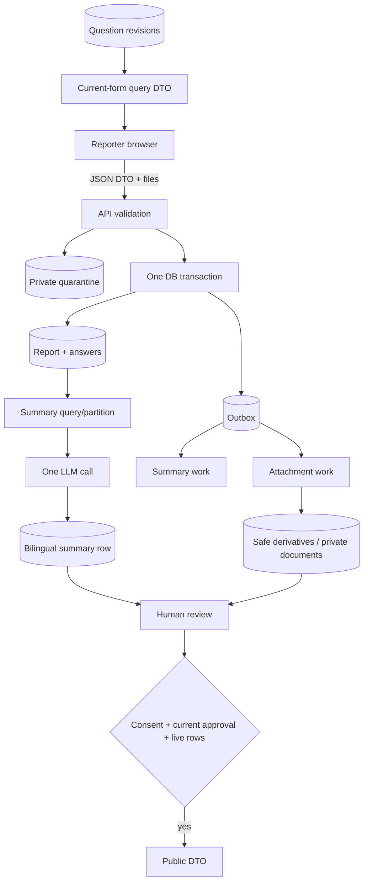

# Interfaces and data flow

## HTTP surface

**CON-IF-001** Resource names are illustrative where implementation has not begun, but the
capability boundaries are normative.
*Verified by: REQ-QB-011, REQ-SUB-018, REQ-MOD-037, REQ-MOD-038.*

### Public/reporting API

| Method and route | Purpose | Result |
|---|---|---|
| `GET /health` | Service health for platform probes | Minimal health response; no dependency details publicly exposed. |
| `GET /api/v1/questions/current` | Load the ordered current form | Bilingual question-revision DTO, cache validator/version allowed. |
| `POST /api/v1/reports` | Submit final report JSON plus optional attachments | `202` with opaque report ID/status. Requires a member bearer token of any role, and rate limited. Stores nothing identifying the member. |
| `GET /api/v1/public/reports` | Paginated public feed | Only publishable public DTO fields. |
| `GET /api/v1/public/reports/{id}` | Public detail | Same allowlisted fields for one publishable report, otherwise `404`. |

**CON-IF-002** There are no draft, upload-slot, blob-proxy, public-answer, or publication-
channel endpoints.
Before `POST /api/v1/reports`, the reporter-facing API is read-only:
unfinished answers remain browser-local and create no report, attachment,
reserved ID, or database state.
*Verified by: REQ-SUB-001, REQ-MOD-039.*

### Authentication API

**CON-IF-003** Each authentication capability is reachable only as stated below.
*Verified by: REQ-MOD-017, REQ-MOD-019.*

| Capability | Authorization |
|---|---|
| Read the authentication configuration, including whether a third-party provider is offered | Anonymous; present in every environment. |
| Exchange development credentials for a signed token | Anonymous, **Development only** — the route does not exist elsewhere. Generic failure. |
| Inspect the current identity's subject and role | Any authenticated member. |

### Admin API

**CON-IF-004** Every admin capability is authorized by the API at the role stated
below, and a write is audited.
*Verified by: REQ-MOD-023, REQ-MOD-024, REQ-MOD-028, REQ-MOD-029.*

| Capability | Authorization |
|---|---|
| List review work and read report detail | SafetyOfficer or Administrator. |
| Edit both summary texts; approve/reject/publish/delete a report | SafetyOfficer or Administrator; audited. No CSRF protection is needed — a bearer token carries no ambient authority. |
| Obtain a short-lived attachment URL | SafetyOfficer or Administrator; safe image/video derivatives or validated private document originals only. |
| List/create/delete eligible question revisions | Administrator; every write audited. |
| Edit a question's choices, curate reporter-added choices, and machine-translate question wording | Administrator; every write audited. |

**CON-IF-005** There is no allowlist-management endpoint. Roles come from the token, and
access is granted or revoked at the identity provider.
*Verified by: REQ-MOD-041.*

**CON-IF-006** Admin mutation routes use explicit command DTOs and concurrency tokens where a
stale edit could overwrite another officer's work. Error bodies are localized
problem details with stable machine codes and no secrets/private values.
*Verified by: REQ-SUB-011.*

## Core ports

**CON-IF-007** Keep ports only at real external boundaries, and keep no port whose only
reason was a removed feature.
*Verified by: none — an internal structural rule with no observable behavior;
it is enforced in review and by the conventions skill.*

- a model summarizer accepting the partitioned DTO and returning the strict
  bilingual draft plus provenance;
- a private blob store supporting bounded stream write/read and short-lived
  derivative read access;
- an attachment detector/processor for controlled image/video derivatives and
  document validation; and
- `TimeProvider` for testable expiry, retries, and lifecycle decisions.

**Authentication needs no port.** The API does not call the identity provider;
it validates a token the provider already signed, which is framework
middleware reading two claims. A port would name a boundary that is not
crossed at request time
([ADR-0064](decisions/ADR-0064-jwt-bearer-authentication-with-three-roles.md)).

Do not keep ports whose only reason was a removed feature: field cipher,
translator, PII auditor, publication channel, email sender, upload-URL slot,
member authenticator, Turnstile verifier, or specialized aircraft processing. A concrete implementation may be used directly
when no domain boundary or second adapter exists.

## Submission-to-review data flow

## Worker coordination

**CON-IF-008** Summarization and each attachment file are separate typed outbox messages with
identifier-only payloads. The Worker deployment registers handlers for both.
A handler loads current database state rather than trusting content in the
message. Work is idempotent: an already completed live summary/file is not
duplicated, and a deleted report is ignored/marked complete without output.
*Verified by: REQ-AI-008, REQ-MED-009, REQ-MOD-040.*

**CON-IF-009** The summary handler builds its DTO at runtime so privacy and labels come from
the immutable revision actually answered. It makes one provider call per
attempt and commits the pair plus message completion coherently. Attachment
handlers operate on one server-minted key, expose only verified image/video
derivatives or validated private document originals, and never extract
documents into the summary flow.
*Verified by: REQ-AI-001, REQ-AI-009, REQ-AI-016, REQ-AI-019, REQ-MED-010.*

## Logging and telemetry boundary

**CON-IF-010** Structured logs may contain request correlation ID, opaque report/work IDs,
route, result code, duration, attempt number, safe attachment type, and stable error
code. They must not contain DTO bodies, answers, question copy when it embeds
answers, private context, model prompts/responses, credentials, bearer tokens,
the submitting member's subject, IP addresses beyond ephemeral security
processing, client filenames, or object URLs.
*Verified by: REQ-AI-021, REQ-SUB-021, REQ-MED-003.*

Metrics aggregate counts and latency. Alerts identify stuck/failed work by
opaque ID so authorized operators can investigate in the application.
