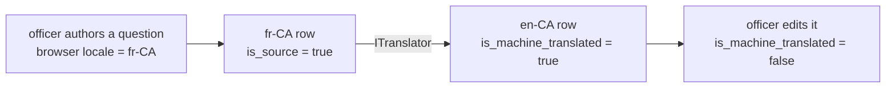
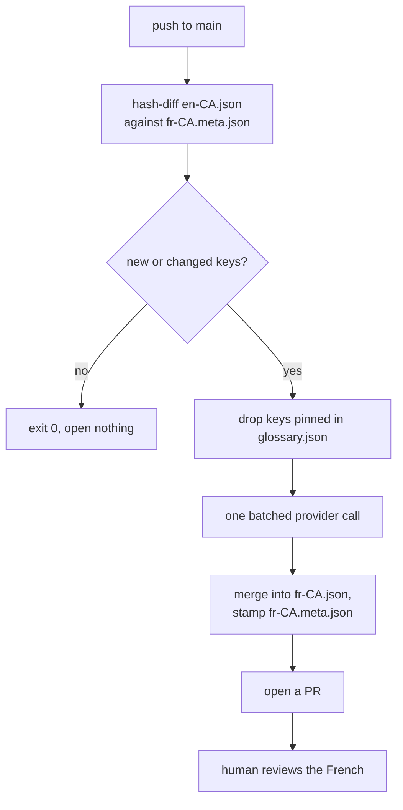
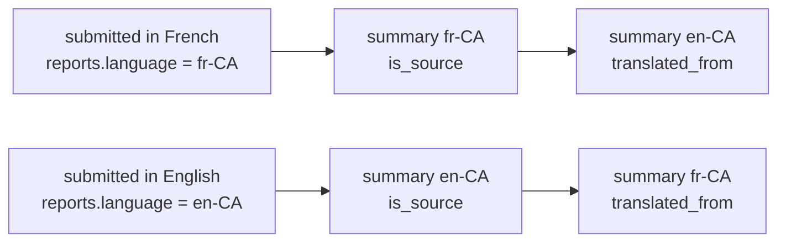

# Localization

HPAC is a national bilingual association. English (`en-CA`) and French (`fr-CA`)
are both first-class here — the public form, the admin UI, API messages, emails,
and published summaries.

## Detection

Client-side, in this order:

1. `?lang=fr` / `?lang=en` — shareable links, and how the toggle works
2. `localStorage` preference from a previous visit
3. `navigator.languages` — any entry with primary subtag `fr` → `fr-CA`
4. Otherwise `en-CA`

English is the fallback for every unmatched locale. A visible EN / FR toggle sits
in the header regardless: detection is a convenience, never a trap. `<html lang>`
is set to the resolved locale.

The API resolves culture from `Accept-Language` via
`RequestLocalizationMiddleware` and returns already-localized messages, so the
client never re-derives them.

## No hardcoded user-facing strings

Every string a person can read comes from the locale files. Public form, admin
UI, validation errors, email subjects and bodies, `<title>`, meta descriptions,
`aria-label`s, empty and loading and error states. No exceptions, and no "it's
just the admin screen".

```
locales/
  en-CA.json       # source of truth: form.*, admin.*, api.errors.*, email.*, common.*
  fr-CA.json       # GENERATED — never hand-edit
  glossary.json    # pinned terms, never machine-translated
  fr-CA.meta.json  # per-key translation provenance
```

One shared set, consumed by **both** the web apps and the API. The .NET side
loads them through a JSON `IStringLocalizer` — JSON rather than `.resx` so there
is exactly one format and the tooling has one input.

Domain values (injury severity, aircraft class, report status) are stored as
stable invariant codes and localized only at the edge. The same row has to
render in both languages; display text never goes in the database.

A CI lint fails the build on user-facing literals outside the locale files.

## Two translation paths, and which is which

`locales/` is **UI chrome**: labels the code ships, translated in CI and reviewed
by a human before it merges. Everything above describes that path.

**Question wording is content**, authored in the admin UI by a safety officer at
runtime. It cannot live in `locales/` — a question created on Tuesday would need
a code change and a deploy before it rendered — so it lives in
`question_translations`, one row per locale, and is translated at authoring time
through `ITranslator`.

| | UI chrome | Question content |
|---|---|---|
| Lives in | `locales/*.json`, git-tracked | `question_translations` rows |
| Translated | In CI, via the configured provider | At authoring time, via `ITranslator` |
| Source language | Always English | Whichever the author was working in |
| Reviewed by | A human, before merge | A human, in the builder, whenever they choose |
| Covered by the #9 lint | Yes | No — it is data, not a literal |



The authoring locale comes from the **browser**, using the detection above. An
officer working in French types French and the English is generated; an officer
working in English gets the reverse. A question cannot be activated for the
public form with a missing counterpart — a machine-translated counterpart is
acceptable, an absent one is not, because a reporter is never shown a
half-translated form.

This does not weaken the rule that raw reports are never translated. That rule is
about reporter data; question wording contains none. See
[ADR-0016](decisions/ADR-0016-data-driven-question-bank.md).

## Translation happens in CI



`.github/workflows/i18n-translate.yml` runs it, on a push to `main` and on
manual dispatch. `tools/translate-locale.mjs` is the tool; `tools/translator.mjs`
is the provider adapter.

**Provider: configuration, not a vendor in the code.** ADR-0007 chose GitHub
Models on the free tier. **GitHub Models was fully retired on 30 July 2026** —
playground, model catalogue, and inference API alike — so there is no free
already-authenticated option inside GitHub Actions any more.

`tools/translator.mjs` therefore declares the `ITranslator` port and takes its
endpoint, model, and key from the workflow. It is the one file to change to swap
provider, and it names no vendor. **Which provider to configure is still an open
question** — see [ADR-0022](decisions/ADR-0022-translation-provider-is-configuration.md),
which lists the candidates and what each one costs in credentials. Until one is
set the job reports which keys are waiting and changes nothing.

Runtime never calls a translation service: no per-visit latency, no per-view
cost, no third-party request from a reporter's browser, and the French is
reviewable in a diff like any other change.

**Change detection is a content hash per key**, not a timestamp and not a
whole-file diff. `locales/fr-CA.meta.json` stores, per key, the SHA-256 of the
English its French was made from:

```json
{
  "form.submit": {
    "source_hash": "9f86d081…",
    "provider": "chat-completions:vendor/a-model",
    "reviewed": false
  }
}
```

An English edit re-translates exactly that key; untouched keys are never re-sent,
so the French does not churn and review stays small. `reviewed` is **never set by
the job** — it is the record of what a human has actually read.

**It opens a PR rather than pushing to `main`.** That is not a workaround for the
ruleset — a human should read the French before it ships. One branch,
`chore/fr-CA-translations`, rebuilt every run, so there is one pull request that
updates rather than a queue of them.

**On pull requests CI only *verifies*.** The `i18n` job runs
`translate-locale.mjs --check`, which reads the three files, constructs no
translator, and fails on drift. It never generates, because fork PRs carry a
read-only token and untrusted code must not trigger inference or write locale
files. `--check` and `--generate` are separate modes and there is no default one.

Two consequences worth knowing before you edit English:

- **Editing `en-CA.json` without regenerating French fails the `i18n` check.**
  That is intended. Merge it, and the translation workflow opens a pull request
  with the French in it.
- **Never hand-edit `fr-CA.json`.** The next run overwrites it. Fix the English,
  or pin the term in `glossary.json`.

Full detail: [ADR-0021](decisions/ADR-0021-ci-translation-opens-a-pull-request.md).

## The glossary is not machine-translated

Pinned in `locales/glossary.json` and never overwritten by the translator:

- The injury severity scale — "Serious injury (secondary medical aid)" is close
  to a defined term, not a phrase
- Rating names: P1–P4, H1–H4, instructor and tandem ratings
- Aircraft certification classes
- The publication-consent question

These need HPAC's own official French wording, ideally taken from the existing
French Typeform. This is the one translation decision a machine must not make.

The file maps a dotted key from `en-CA.json` to its official French. An entry is
either the French string itself, or an object carrying `fr-CA` plus a note
saying where the wording came from. Keys beginning `_` are file-level commentary,
not pins:

```json
{
  "_note": "HPAC official French. Never machine-translated. See ADR-0007.",
  "form.injury.severity.serious": "…",
  "form.consent.publish": {
    "fr-CA": "…",
    "note": "Wording from the French Typeform, 2024."
  }
}
```

A pinned key takes its French from here verbatim, is stamped
`provider: "glossary", reviewed: true`, and is never put in a translation
request. Editing the *English* of a pinned key does not change its French — only
HPAC may say when that wording changes. The `i18n` check fails if `fr-CA.json`
ever stops matching a pin.

## Reports and summaries

**The raw report is never translated.** It stays as the reporter wrote it — it is
evidence, and a translated account of a crash is a paraphrased account of a
crash.

`reports.language` records the locale it was written in. The summarizer
summarizes **in that language**, then the summary is translated into the other,
so both versions exist for every report:



The translation gets its own PII audit — a model producing fluent French can
reintroduce a detail the scrub removed. A safety officer approves the pair, side
by side; approving one does not approve the other.

Note the split: the UI-string job runs inside GitHub Actions, against whichever
provider is configured there. The worker runs in production and translates
through the Anthropic client it already holds. One `ITranslator` contract, two
implementations in two runtimes — `tools/translator.mjs` and
`HpacSafety.Core.SharedKernel.ITranslator` — because they cannot share a type.

(ADR-0007 justified that split by GitHub Models being free inside Actions. That
reason is gone with the service; the split survives it, because the worker still
has no Actions token and Actions still should not hold a production runtime
credential without a deliberate decision. See ADR-0022.)

## Formatting

Dates (`fr-CA` uses `AAAA-MM-JJ`), the province list, and a 24-hour clock all
follow the resolved locale.

## Related

- `docs/decisions/ADR-0007-localization.md`
- `docs/decisions/ADR-0021-ci-translation-opens-a-pull-request.md`
- `docs/decisions/ADR-0022-translation-provider-is-configuration.md`
- `docs/anonymization-policy.md`
