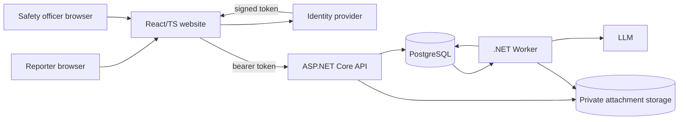
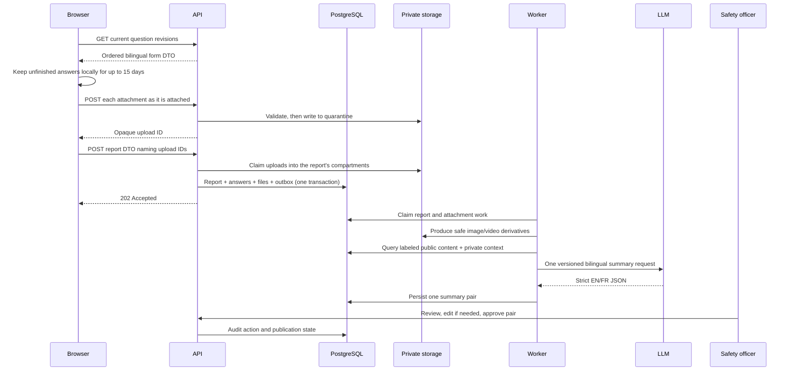

# System overview

## Purpose

HPAC Safety collects voluntary hang-gliding and paragliding incident reports so
the association can learn from occurrences without publicly identifying the
people involved. The system mirrors the questions maintained by HPAC, stores
the exact question revisions a reporter saw, produces a bilingual anonymized
summary, and requires a human publication decision.

The design optimizes for a small, auditable safety system rather than a generic
forms platform, document-management suite, or publishing network.

## Non-negotiable outcomes

Each outcome carries a stable constraint ID and names the claims that verify it
([ADR-0084](decisions/ADR-0084-stable-claim-ids-and-a-generated-traceability-matrix.md)).

- **CON-SO-001** Questions are bilingual database records and complete
  revisions are immutable.
  *Verified by: REQ-QB-001, REQ-QB-002, REQ-QB-009.*
- **CON-SO-002** Only the two consent questions are mandatory by rule:
  publication consent always, and media consent whenever it is shown. Neither
  has a default.
  *Verified by: REQ-QB-014, REQ-QB-016, REQ-QB-112, REQ-QB-113.*
- **CON-SO-003** Raw answers and image or video originals are private and never
  returned by a public API. A visitor can reach only a published report's
  verified image and video derivatives, when media was consented to, and its
  validated documents' unchanged originals as forced downloads, when
  `consent_documents` is true
  ([ADR-0117](decisions/ADR-0117-a-published-report-shows-the-reporters-photos-and-video.md),
  [ADR-0119](decisions/ADR-0119-a-published-report-offers-its-documents-for-download.md)).
  *Verified by: REQ-MOD-036, REQ-MED-025, REQ-MED-026, REQ-MED-037, REQ-MED-039.*
- **CON-SO-004** One Worker-owned prompt and one model call produce both
  official-language summary texts.
  *Verified by: REQ-AI-001, REQ-AI-011.*
- **CON-SO-005** Private answers help the model recognize identifying material
  but may not contribute facts to a summary.
  *Verified by: REQ-AI-007, REQ-AI-024, and the reviewer checklist in the
  [AI anonymization detail](../features/ai-anonymization/README.md#reviewer-checklist).*
- **CON-SO-006** Both summary texts are one reviewable unit with one human
  approval.
  *Verified by: REQ-AI-017, REQ-MOD-033.*
- **CON-SO-007** Positive consent and approval are independent, mandatory
  publication gates.
  *Verified by: REQ-DOM-003, REQ-MOD-035.*
- **CON-SO-008** Deletion immediately hides a report while preserving the audit
  trail and retained records.
  *Verified by: REQ-DOM-007.*

## Components

- One React/TS website serves both audiences, with the admin surface as a route
  rather than a separate site
  ([ADR-0048](decisions/ADR-0048-one-website-admin-as-a-route.md)). It renders
  the form and keeps unfinished answers only in that browser. No report data
  reaches the API or database until it submits one finalized request; the one
  exception is an attachment, uploaded through the API to private quarantine
  when it is attached and claimed by that request
  ([ADR-0096](decisions/ADR-0096-an-attachment-uploads-on-attach-and-is-claimed-at-submission.md)). It also renders public
  summaries.
- The `/admin` route manages questions and their choices, reviews reports
  and derivatives, edits summaries, and records approval. It appears only for a
  token carrying the SafetyOfficer or Administrator role.
- The API owns validation, authorization, persistence orchestration, read DTOs,
  and the public publication boundary. It never calls the model.
- PostgreSQL is the system of record and its outbox is the durable Worker handoff.
- Private object storage holds quarantined originals and safe derivatives.
- The Worker claims outbox rows, validates attachments, creates image/video derivatives, builds the
  partitioned summary DTO, calls the model once, validates its response, and
  persists the summary pair. Documents are not model input.
- An identity provider signs a token; the API validates it and reads the
  subject and role claims. Filing a report requires a member of any role, and
  records nothing about them. No user record is stored anywhere.

## Primary flow

## Supported scope

The target includes a data-driven form, optional image, video, and document
attachments,
bilingual UI and summary text, admin question editing, member authentication
against an external identity provider, an internal review queue, public feed
and detail views, audit logging, soft deletion, and one Canadian AWS
production environment.

## Explicitly out of scope

**CON-SO-009** The system does not include any of the following, and an
implementation that adds one has exceeded its scope.
*Verified by: REQ-MOD-039 for the publication channel; none for the rest — a
scenario can assert what the system does, not enumerate what it never grew.*

- General-purpose form branching, surveys, scoring, or form templates
- Server-side drafts, a resumable or chunked upload protocol, or a pre-signed
  upload URL handed to a reporter
- Direct messages, email notifications, WhatsApp, Telegram, or social posting
- Public raw reports, questions, answers, attachment originals, or audit
  history. A published report's verified image and video derivatives, and its
  validated documents as forced downloads, are the exceptions
  ([ADR-0117](decisions/ADR-0117-a-published-report-shows-the-reporters-photos-and-video.md),
  [ADR-0119](decisions/ADR-0119-a-published-report-offers-its-documents-for-download.md))
- A CDN-served or public-bucket copy of any attachment
- A comment author's name, email address, or HPAC number (#413), and replies,
  reactions, or notifications on comments
- Automatic approval or publication
- Identity-provider-specific authorization rules in domain code
- Application-managed encryption keys or ciphertext fields
- Physical record deletion or a restore UI
- Translating administrator-authored question text unless an administrator
  asks for a draft and saves it
  ([ADR-0062](decisions/ADR-0062-administrators-may-machine-translate-question-text.md))
- A standalone PII service or specialized aircraft-processing subsystem

## Design ownership

Core owns domain rules and small ports. Token validation and role policies are
framework middleware configured in the API, not an Infrastructure adapter —
the API validates a token the provider already signed rather than calling
anything. Infrastructure implements persistence,
storage, attachment tooling, and the model client. API and Worker
compose those pieces into use cases. The website consumes HTTP DTOs and share
only static assets and presentation utilities. See
[interfaces and data flow](interfaces-and-data-flow.md) for exact boundaries.
