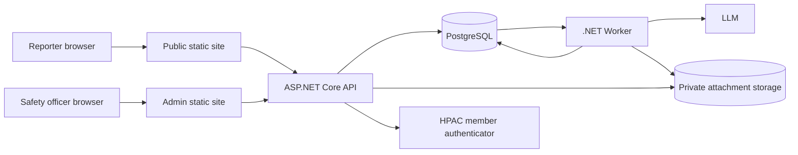
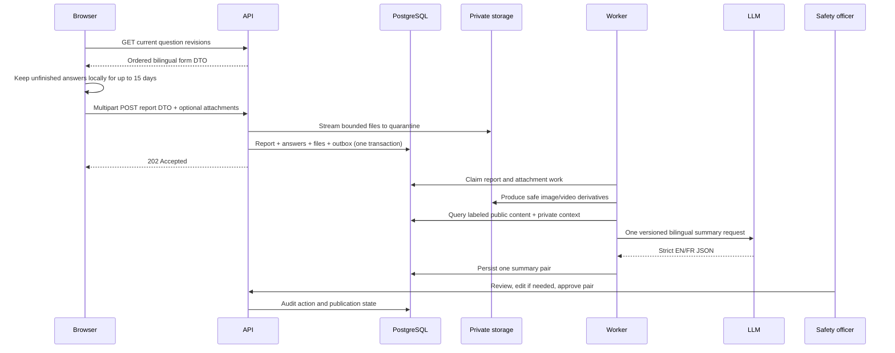

# System overview

## Purpose

HPAC Safety collects voluntary hang-gliding and paragliding incident reports so
the association can learn from occurrences without publicly identifying the
people involved. The system mirrors the questions maintained by HPAC, stores
the exact question revisions a reporter saw, produces a bilingual anonymized
summary, and requires a human publication decision.

The design optimizes for a small, auditable safety system rather than a generic
forms platform, document-management suite, or publishing network.

## Non-negotiable outcomes

- Questions are bilingual database records and complete revisions are
  immutable.
- Only publication consent is mandatory; it has no default.
- Raw answers and originals are private and never returned by a public API.
- One Worker-owned prompt and one model call produce both official-language
  summary texts.
- Private answers help the model recognize identifying material but may not
  contribute facts to a summary.
- Both summary texts are one reviewable unit with one human approval.
- Positive consent and approval are independent, mandatory publication gates.
- Deletion immediately hides a report while preserving the audit trail and
  retained records.

## Components

- The public static site renders the form and keeps unfinished answers only in
  that browser. No report data reaches the API, database, or object storage
  until it submits one finalized multipart request. It also renders public
  summaries.
- The separate admin static site manages questions and authorized members,
  reviews reports and derivatives, edits summaries, and records approval.
- The API owns validation, authorization, persistence orchestration, read DTOs,
  and the public publication boundary. It never calls the model.
- PostgreSQL is the system of record and its outbox is the durable Worker handoff.
- Private object storage holds quarantined originals and safe derivatives.
- The Worker claims outbox rows, validates attachments, creates image/video derivatives, builds the
  partitioned summary DTO, calls the model once, validates its response, and
  persists the summary pair. Documents are not model input.
- The member-authentication adapter proves an admin's identity; the local
  allowlist determines authorization.

## Primary flow

## Supported scope

The target includes a data-driven form, optional image, video, and document
attachments,
bilingual UI and summary text, admin question editing, a member allowlist, an
internal review queue, public feed and detail views, audit logging, soft
deletion, and one Canadian AWS production environment.

## Explicitly out of scope

- General-purpose form branching, surveys, scoring, or form templates
- Server-side drafts or resumable upload sessions
- Direct messages, email notifications, WhatsApp, Telegram, or social posting
- Public raw reports, questions, answers, attachments, or audit history
- Automatic approval or publication
- Identity-provider-specific authorization rules in domain code
- Application-managed encryption keys or ciphertext fields
- Physical record deletion or a restore UI
- Automated translation of administrator-authored question text
- A standalone PII service or specialized aircraft-processing subsystem

## Design ownership

Core owns domain rules and small ports. Infrastructure implements persistence,
storage, authentication, attachment tooling, and the model client. API and Worker
compose those pieces into use cases. The web sites consume HTTP DTOs and share
only static assets and presentation utilities. See
[interfaces and data flow](interfaces-and-data-flow.md) for exact boundaries.
