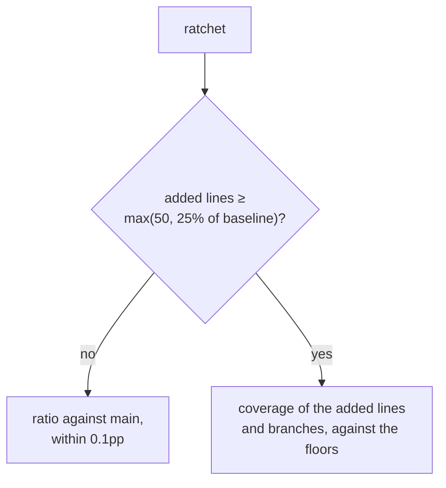

# Testing conventions

## Shouldly, always

Not `Assert.*`, not FluentAssertions. Shouldly is pinned in
`Directory.Packages.props`, and **`Xunit.Assert` is banned outright** — using it
is a build error, in the editor and in a local `dotnet build`, not just in CI:

```
error RS0030: The symbol 'Assert' is banned in this project: Use Shouldly.
value.ShouldBe(expected), not Assert.Equal(expected, value).
```

The reason is legibility in a log. Shouldly names the expression under test in
its failure message, which matters when the reader is an agent reading CI output
rather than a person sitting at a debugger:

| | on failure |
|---|---|
| `summary.Text.ShouldNotContain("Vince")` | prints the text that contained it |
| `Assert.False(summary.Text.Contains("Vince"))` | `Expected: False, Actual: True` |

The mechanism is `Microsoft.CodeAnalysis.BannedApiAnalyzers` reading
[`tests/BannedSymbols.txt`](../tests/BannedSymbols.txt), wired up in
`Directory.Build.props` for every `*.Tests` project. Add future bans to that
file. Why an analyzer rather than a CI grep:
[ADR-0013](decisions/ADR-0013-ban-assert-rather-than-grep-for-it.md).

If a test ever legitimately needs it, `#pragma warning disable RS0030` with a
comment saying why. That is visible in review, which is the point.

```csharp
summary.Text.ShouldNotContain("403-555-0134");
result.Status.ShouldBe(ReportStatus.PendingReview);
Should.Throw<TurnstileVerificationException>(() => verifier.Verify(token));
```

## Given / When / Then

In the test name and marked in the body, in that order:

```csharp
[Fact]
public async Task Given_a_report_naming_the_pilot_When_the_summary_is_generated_Then_the_name_is_absent()
{
    // Given
    var report = ReportBuilder.Default().WithDescription("Sarah spiralled in from 200 feet");

    // When
    var summary = await _pipeline.RunAsync(report);

    // Then
    summary.Text.ShouldNotContain("Sarah");
}
```

It reads as a sentence in test output, which is exactly what a reviewer sees.

JavaScript uses `node:test` with nesting that produces the same sentence:

```js
describe('Given a browser advertising fr-CA', () => {
  describe('When the locale is resolved', () => {
    it('Then it selects fr-CA', () => { /* ... */ })
  })
})
```

## Projects

| Project | Scope |
|---|---|
| `HpacSafety.Core.Tests` | Pure unit. No database, no network. The deterministic scrub lives here. |
| `HpacSafety.Api.Tests` | `WebApplicationFactory` + Testcontainers Postgres |
| `HpacSafety.Infrastructure.Tests` | Migrations, mapping, field encryption, and the seeded question bank. Testcontainers Postgres |
| `HpacSafety.Worker.Tests` | Outbox claiming, retry, poison handling; recorded model fixtures |
| `HpacSafety.Anonymization.Tests` | Golden-file PII suite |
| `tests/js` | `node --test` for i18n, api-client, form logic |
| `tests/e2e` | Playwright, both locales |

### Integration tests need Docker

`HpacSafety.Api.Tests` and `HpacSafety.Infrastructure.Tests` start a real
PostgreSQL container through Testcontainers, pinned to `postgres:17-alpine` — a database version that moves
underneath the suite is a failure nobody can reproduce.

Those tests carry `[Trait("Category", "Integration")]`, so a machine without a
running Docker daemon can skip them:

```bash
dotnet test --filter "Category!=Integration"
```

CI runs everything. Do not make the skip automatic: a test that silently skips
itself is a test that stops running and nobody notices.

## Testing anything that calls a model

**Never assert on an exact generated sentence.** Models drift and the test
becomes noise that gets muted, which is worse than no test.

Assert on:

- **Absence of a specific identifier** — the phone number, the name, the site.
- Structural properties — language, length bounds, required sections present.
- Behaviour around the call — retry, backoff, what happens on a failure.

Recorded fixtures rather than live calls, so the suite runs on a fork PR with no
API key.

## Coverage

Two checks, both in the `coverage` CI job:

| Check | Rule |
|---|---|
| Floor | 80% line, 70% branch |
| Ratchet | Must not dilute coverage — see the two modes below |

The floor stops the number sinking over years. The ratchet stops one pull
request adding a large body of untested code while staying just above the floor.
Neither works alone.

### The ratchet has two modes

Comparing whole-repository percentages only means something when both sides are
roughly the same size. A branch that adds a subsystem to a small codebase moves
the ratio on its own, and a scaffolding baseline sits at a perfect score it can
only lose. So the gate picks its comparison:



Every deletion and every ordinary change takes the ratio path, so dropping a test
suite still fails. A branch that grows the codebase materially is judged on what
it added — "the 450 lines this branch adds are 20.00% covered" — and the pull
request comment says which mode ran. See
[ADR-0017](decisions/ADR-0017-ratchet-judges-added-code.md).

**Neither mode is a reason to delete a defensive guard.** An invariant check that
no test can reach through the public API is doing its job; the floors have room
for a few of them. If you find yourself removing a `throw` to move a percentage,
stop — that is the failure this gate exists to prevent, not a way to satisfy it.

```bash
dotnet test HpacSafety.slnx --collect:"XPlat Code Coverage" \
  --settings coverlet.runsettings --results-directory ./artifacts/coverage
dotnet tool restore
dotnet tool run reportgenerator \
  "-reports:./artifacts/coverage/**/coverage.cobertura.xml" \
  "-targetdir:./artifacts/report" -reporttypes:"Cobertura;HtmlInline"
node tools/coverage-gate.mjs --report ./artifacts/report/Cobertura.xml
```

`./artifacts/report/index.html` is the per-line view.

### What is excluded, and why it matters

`coverlet.runsettings` drops generated code, migrations, `[ExcludeFromCodeCoverage]`,
and the test assemblies. This is not tidying. Measured without it,
`HpacSafety.Api` reports **4.8% while `Program.cs` is at 100%** — the gap is ~440
lines the OpenApi source generator writes into `obj/`. A gate reading that number
would be measuring the SDK.

### The baseline

The ratchet compares against the Cobertura artifact from `main`'s last green CI
run — not a committed number, which the gated change could edit, and not a
recomputation, which would double the job. If no baseline is available the
ratchet skips with a notice and the floor still applies. See
[ADR-0014](decisions/ADR-0014-coverage-gate.md).

### Do not optimise for this

Coverage is a floor, not a goal. This repository could sit at 95% and still
publish someone's phone number.

`HpacSafety.Anonymization.Tests` is what protects a reporter. The pull request
template asks what behaviour a new test pins down, not whether the number went
up.

## Related

- `skills/hpac-safety-conventions/SKILL.md`
- `docs/anonymization-policy.md`
