# Domain and lifecycle

Supporting detail for
[`domain-and-lifecycle.feature`](domain-and-lifecycle.feature) that doesn't
fit Gherkin.

## Lifecycle diagram

```mermaid
stateDiagram-v2
    [*] --> Submitted
    Submitted --> Summarizing: Worker claims summary job
    Summarizing --> PendingReview: valid bilingual pair saved
    Summarizing --> SummaryFailed: bounded retries exhausted
    SummaryFailed --> PendingReview: officer writes both texts
    PendingReview --> PendingReview: either text edited; approval cleared
    PendingReview --> Approved: officer approves pair
    PendingReview --> Rejected: officer rejects report
    Approved --> PendingReview: either text edited
    Approved --> Published: consent yes and report not deleted
    Published --> PendingReview: either text edited
```

Soft deletion may occur from any state and is a terminal application state
even though retained rows still contain their prior status.

## Aggregate boundaries

The report aggregate owns its answers, files, bilingual summary pair, and
report-related outbox work for invariants and deletion. Question revisions are
a separate aggregate. There is no user aggregate — identity lives in the
token, never in the database
([ADR-0065](../../docs/decisions/ADR-0065-no-user-records-identity-is-the-token-subject.md)).
Audit-log entries are append-only records. Storage objects are referenced by opaque keys but are not database
entities.

## Soft deletion mechanics

Every persisted entity/table except `audit_log` has a nullable PostgreSQL
`deleted timestamptz` column mapped from the C# property `Deleted`.
Application queries use global filters by default. Administrative
investigations that intentionally include deleted rows use an explicit
unfiltered query and remain authorized and audited. `audit_log` has no
`Deleted` column and no delete operation.

## Identity and time

External IDs use the repository's opaque TinyId value rather than sequential
database identifiers. Persisted instants use `DateTimeOffset`/`timestamptz`.
Question answers that represent a date use `DateOnly`; local wall-clock
answers use `TimeOnly`; unspecified `DateTime` is prohibited. Enum values
persist as stable lowercase codes and are localized only at UI/API-message
edges.

## Out of scope

What not to build here. The global list in
[system overview](../../docs/system-overview.md) still holds; this narrows it
to this area ([ADR-0083](../../docs/decisions/ADR-0083-specification-driven-development.md)).

- Undelete, restore, or any path back from a soft deletion.
- Physical deletion of an application record, or a cascade that removes rows
  rather than stamping them.
- An automated purge or retention job over raw reports. Retention ends at an
  explicit deletion.
- Lifecycle states beyond the ones the scenarios name, or a workflow engine to
  move between them.
- Ownership of a report by a member. A report belongs to no one
  ([ADR-0067](../../docs/decisions/ADR-0067-a-reporter-must-be-a-member-and-is-not-recorded.md)).
