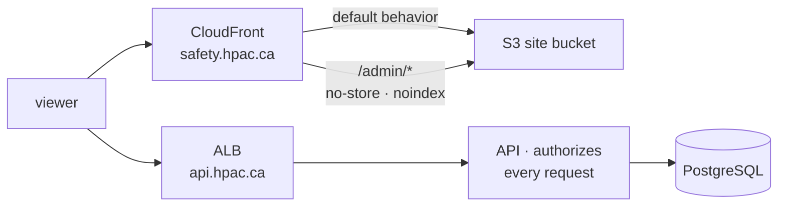
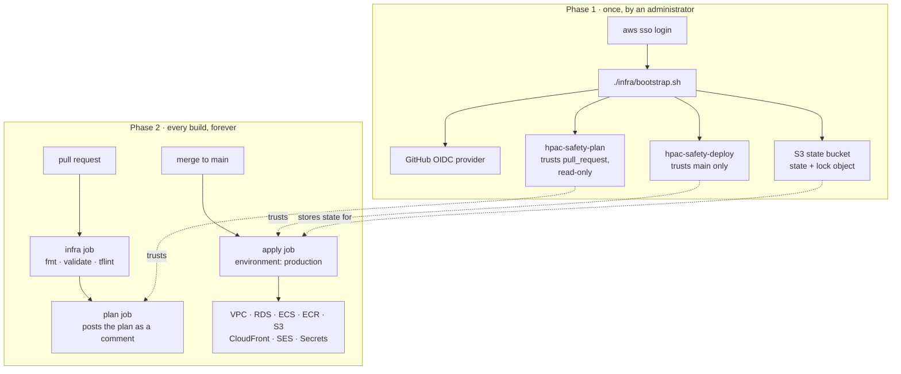

# infra

The AWS environment for HPAC Safety, as Terraform, in `ca-central-1`.

Hosting rationale is [ADR-0009](../docs/decisions/ADR-0009-hosting-on-aws.md);
choosing Terraform and a scripted bootstrap is
[ADR-0010](../docs/decisions/ADR-0010-infrastructure-as-code.md); the shape of
this directory is [ADR-0031](../docs/decisions/ADR-0031-terraform-shape-and-topology.md);
the CI story is [ADR-0032](../docs/decisions/ADR-0032-terraform-ci-without-an-aws-account.md).

> **Status: not yet applied.** The AWS account does not exist. Everything here is
> written, formatted, validated, and linted on every pull request, and none of it
> has been run against AWS. The outstanding human-only steps are in
> [`docs/deployment.md`](../docs/deployment.md) and on
> [#32](https://github.com/HPAC-Safety/safety-report/issues/32).

## What this slice owns

Everything in the account except the four things that must exist before
Terraform can authenticate at all.

| Area | Files | Resources |
|---|---|---|
| Network | `network.tf`, `security-groups.tf` | VPC, public and private subnets across two AZs, one NAT gateway, S3 gateway endpoint, four security groups |
| Data | `database.tf` | RDS PostgreSQL, subnet group, parameter group, automated backups |
| Compute | `ecs.tf`, `alb.tf`, `iam.tf` | ECS cluster, API and Worker Fargate services, a migrate task definition, an ALB, execution and task roles |
| Registry | `ecr.tf` | Two repositories with lifecycle policies |
| Storage | `storage.tf` | Private uploads bucket with the `quarantine/` expiry rule, one static site bucket |
| CDN | `cdn.tf`, `functions/clean-urls.js.tftpl` | One CloudFront distribution, an admin cache behavior and response headers policy, origin access control, one CloudFront Function |
| Mail | `ses.tf` | Domain identity, Easy DKIM, custom MAIL FROM, configuration set |
| Secrets | `secrets.tf` | Four Secrets Manager **entries**. No values. |
| Observability | `observability.tf` | Three log groups, an SNS topic, four alarms |
| Certificates | `acm.tf` | One ALB certificate, one CloudFront certificate in `us-east-1`. Both hostnames are HTTPS-only. |

## What it deliberately does not own

- **The bootstrap resources.** OIDC provider, deploy role, read-only plan role,
  state bucket. A workflow cannot create the thing that lets it authenticate, so
  `bootstrap.sh` does — see below. There is no DynamoDB lock table: the S3
  backend locks with an object in the state bucket (`use_lockfile`), which
  supersedes ADR-0010's locking clause — see ADR-0031.
- **Secret values.** Terraform creates the entry; a human sets the value with
  `aws secretsmanager put-secret-value`. A value in a `.tfvars` file is a value
  in state, and state is a file in S3 more people can read than should see an API
  key. There is no `aws_secretsmanager_secret_version` in this directory and
  adding one is the defect, not the fix.
- **DNS on `hpac.ca`.** Another organisation's zone. Every record a human has to
  publish is in the `dns_records_to_publish` output.
- **Which image is running.** Terraform owns the *shape* of a task definition;
  the deploy workflows register revisions with the commit SHA CI tested. See
  ADR-0031.
- **Shipping content.** `deploy-api.yml`, `deploy-worker.yml`, and
  `deploy-web.yml` push artifacts into what this creates.
- **Promoting an upload out of `quarantine/`.** This slice owns the bucket and
  the lifecycle rule that expires anything left there; the ingest that sniffs the
  content type, strips EXIF, and moves the object to `<report-id>/…` is
  application code ([#16](https://github.com/HPAC-Safety/safety-report/issues/16)).
  The rule is what catches the case where that ingest never ran — see
  [`docs/deployment.md`](../docs/deployment.md#uploads-the-quarantine-prefix).
  Its timing is a floor, not a deadline.
- **Cloudflare Turnstile.** ADR-0010 anticipates managing the widget here too.
  It is not in this slice: it needs a long-lived Cloudflare API token that does
  not exist yet, and it is the one place a secret is knowingly allowed into
  state. It comes with the Turnstile work.

## The topology

Two hostnames, and **one website**. The admin review queue is a route on it, not
a site of its own — this supersedes ADR-0009's "one distribution each for public
and admin". [ADR-0031](../docs/decisions/ADR-0031-terraform-shape-and-topology.md)
records the decision, what it gives up, and why that is acceptable.

| URL | Serves |
|---|---|
| `https://safety.hpac.ca/` | The public report form |
| `https://safety.hpac.ca/admin/` | The admin review queue |
| `https://api.hpac.ca` | The API. HTTPS only; port 80 redirects. |



**Collapsing the two areas onto one distribution removes origin-level isolation
between them.** WAF, geo restriction, and IP allowlisting are distribution-level
in CloudFront, so none of them can be applied to the admin area alone any more.
What protects the review queue is the API's authorization (#24) — the admin
bundle is static HTML and JavaScript that holds no report data, and it never was
the boundary. If that ever stops being true, revisit ADR-0031 rather than working
around it.

What still applies per path: a separate cache behavior (`CachingDisabled`), the
URL-rewrite function, and a response headers policy adding
`X-Robots-Tag: noindex, nofollow` and `Cache-Control: no-store`.

## The two phases



**No long-lived AWS credential is ever created** — not for the bootstrap, not
afterwards. There is no access key in this repository, in GitHub, or in IAM, and
there never should be. If you find yourself writing one, that is the defect.

## Running the bootstrap

Once per account, by an administrator, against their own session.

```bash
aws sso login
./infra/bootstrap.sh
```

It is idempotent: re-running converges the existing resources onto the
definitions in the script and changes nothing else. That is how a trust policy
gets edited — change the constant at the top and run it again.

Progress goes to stderr; the deploy role ARN is the only thing on stdout, so it
pipes:

```bash
gh secret set AWS_DEPLOY_ROLE_ARN --repo HPAC-Safety/safety-report --body "$(./infra/bootstrap.sh)"
```

The plan role ARN and the state bucket name are printed in the closing
instructions, and go in as `AWS_PLAN_ROLE_ARN` and the `TF_STATE_BUCKET`
variable.

## Working on the Terraform locally

Terraform is pinned in `.terraform-version` and tflint in `.tflint-version` —
each in exactly one file, read from there by CI, per `AGENTS.md`. `tfenv`,
`asdf`, and `mise` all read `.terraform-version` on their own.

Everything below runs with **no AWS account and no credentials**, and is exactly
what the `infra` CI job runs:

```bash
terraform -chdir=infra fmt -check -recursive -diff
terraform -chdir=infra init -backend=false -lockfile=readonly
terraform -chdir=infra validate
tflint --chdir=infra --init && tflint --chdir=infra
shellcheck -s sh infra/bootstrap.sh

# The CloudFront Function is a Terraform template. Substitute the prefix, then
# parse it — this is what the `infra` CI job does.
sed 's|\${admin_prefix}|/admin|' infra/functions/clean-urls.js.tftpl > /tmp/clean-urls.js
node --check /tmp/clean-urls.js
```

`terraform plan` needs the account and is not runnable yet.

## Decided values

Every default in `variables.tf` was decided by the repository owner and is marked
`DECIDED` there with the reasoning. None of them is a guess.

| Variable | Value | Why |
|---|---|---|
| `site_domain` | `safety.hpac.ca` | One website; the review queue is a route on it |
| `api_domain` | `api.hpac.ca` | HTTPS only; port 80 redirects |
| `admin_path_prefix` | `admin` | Drives the cache behavior, the headers policy, and the rewrite function — defined once |
| `db_instance_class` | `db.t4g.micro` | ADR-0009: the smallest viable sizes are correct here |
| `db_backup_retention_days` | `7` | The window in which an accidental deletion is recoverable |
| `db_multi_az` | `false` | Roughly doubles the RDS bill to shorten an outage |
| `alarm_email_addresses` | `["safety@hpac.ca"]` | The single production address. A role address, so an alarm does not stop being read when someone leaves the committee. |
| `summary_failed_alarm_threshold` | `1` in 5 min | One failure means a real report is unprocessed |
| `outbox_age_alarm_seconds` | `900`, two periods | A report waiting a quarter of an hour means the worker is wedged, not busy |

### One address, and it is inert until two other things land

`safety@hpac.ca` is **the** production address for this system: report
notifications from the Worker and operational alarms from CloudWatch both go
there. There is not a second one, and #26 must not invent one.

It is silent today, for two independent reasons, and neither is visible from
Terraform:

- **Alarms.** The SNS email subscription is created *pending confirmation*. AWS
  emails a link and a human has to click it; Terraform cannot, and reports the
  subscription as created either way. Until someone clicks, alarms fire, are
  visible in CloudWatch, and email nobody. Alarm mail comes from Amazon SNS, so
  it is *not* held up by the SES sandbox.
- **Report notifications.** These go through SES as `hpac.ca`, so they need the
  DKIM and MAIL FROM records published on `hpac.ca` **and** SES production access
  granted. In sandbox, SES will not deliver to an address it has not individually
  verified.

Both paths end at the same inbox, and receiving mail there depends on HPAC's
existing MX and mailbox, which this account neither owns nor touches. The custom
MAIL FROM record is on the `mail.` subdomain precisely so it cannot disturb that.

## The metric contract

Two of the alarms watch metrics **the application publishes**. They are not
derived from anything AWS knows on its own, so the Worker has to emit them or the
alarms watch nothing.

| Namespace | Metric | Kind | Published by | Meaning |
|---|---|---|---|---|
| `HpacSafety` | `SummaryFailed` | count | Worker | A summarization attempt failed. A real report is sitting unprocessed. |
| `HpacSafety` | `OutboxOldestAgeSeconds` | gauge, each poll | Worker | Age of the oldest unclaimed outbox row. Rises when the Worker is wedged; flat when it is merely busy — which is why it is the age and not the depth. |

The namespace is injected as `Metrics__Namespace`. Both task roles may call
`cloudwatch:PutMetricData`, and only within that namespace.

`OutboxOldestAgeSeconds` alarms on **missing data**: a Worker that has stopped
publishing entirely is the failure the alarm is for.

## Ordering on a fresh account

The first apply does not produce a working system on its own, and that is a
property of bootstrapping rather than a defect. The order is in
[`docs/deployment.md`](../docs/deployment.md#first-deploy-on-a-fresh-account).
