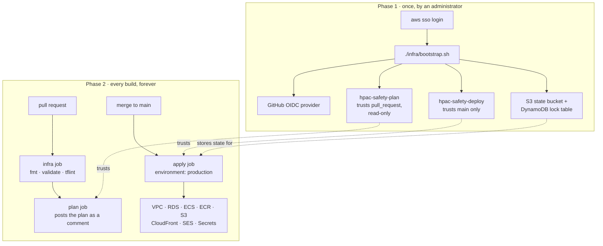

# infra

The AWS environment for HPAC Safety, as Terraform, in `ca-central-1`.

Hosting rationale is [ADR-0009](../docs/decisions/ADR-0009-hosting-on-aws.md);
choosing Terraform and a scripted bootstrap is
[ADR-0010](../docs/decisions/ADR-0010-infrastructure-as-code.md); the shape of
this directory is [ADR-0031](../docs/decisions/ADR-0031-one-terraform-root-module.md);
the CI story is [ADR-0032](../docs/decisions/ADR-0032-terraform-ci-without-an-aws-account.md).

> **Status: not yet applied.** The AWS account does not exist. Everything here is
> written, formatted, validated, and linted on every pull request, and none of it
> has been run against AWS. The outstanding human-only steps are in
> [`docs/deployment.md`](../docs/deployment.md) and on
> [#32](https://github.com/HPAC-Safety/safety-report/issues/32).

## What this slice owns

Everything in the account except the four things that must exist before
Terraform can authenticate at all.

| Area | Files | Resources |
|---|---|---|
| Network | `network.tf`, `security-groups.tf` | VPC, public and private subnets across two AZs, one NAT gateway, S3 gateway endpoint, four security groups |
| Data | `database.tf` | RDS PostgreSQL, subnet group, parameter group, automated backups |
| Compute | `ecs.tf`, `alb.tf`, `iam.tf` | ECS cluster, API and Worker Fargate services, a migrate task definition, an ALB, execution and task roles |
| Registry | `ecr.tf` | Two repositories with lifecycle policies |
| Storage | `storage.tf` | Private uploads bucket, two static site buckets |
| CDN | `cdn.tf`, `functions/clean-urls.js` | Two CloudFront distributions, origin access controls, one CloudFront Function |
| Mail | `ses.tf` | Domain identity, Easy DKIM, custom MAIL FROM, configuration set |
| Secrets | `secrets.tf` | Four Secrets Manager **entries**. No values. |
| Observability | `observability.tf` | Three log groups, an SNS topic, four alarms |
| Certificates | `acm.tf` | One ALB certificate, one CloudFront certificate in `us-east-1` |

## What it deliberately does not own

- **The four bootstrap resources.** OIDC provider, deploy role, state bucket,
  lock table. A workflow cannot create the thing that lets it authenticate, so
  `bootstrap.sh` does — see below.
- **Secret values.** Terraform creates the entry; a human sets the value with
  `aws secretsmanager put-secret-value`. A value in a `.tfvars` file is a value
  in state, and state is a file in S3 more people can read than should see an API
  key. There is no `aws_secretsmanager_secret_version` in this directory and
  adding one is the defect, not the fix.
- **DNS on `hpac.ca`.** Another organisation's zone. Every record a human has to
  publish is in the `dns_records_to_publish` output.
- **Which image is running.** Terraform owns the *shape* of a task definition;
  the deploy workflows register revisions with the commit SHA CI tested. See
  ADR-0031.
- **Shipping content.** `deploy-api.yml`, `deploy-worker.yml`, and
  `deploy-web.yml` push artifacts into what this creates.
- **Cloudflare Turnstile.** ADR-0010 anticipates managing the widget here too.
  It is not in this slice: it needs a long-lived Cloudflare API token that does
  not exist yet, and it is the one place a secret is knowingly allowed into
  state. It comes with the Turnstile work.

## The two phases



**No long-lived AWS credential is ever created** — not for the bootstrap, not
afterwards. There is no access key in this repository, in GitHub, or in IAM, and
there never should be. If you find yourself writing one, that is the defect.

## Running the bootstrap

Once per account, by an administrator, against their own session.

```bash
aws sso login
./infra/bootstrap.sh
```

It is idempotent: re-running converges the existing resources onto the
definitions in the script and changes nothing else. That is how a trust policy
gets edited — change the constant at the top and run it again.

Progress goes to stderr; the deploy role ARN is the only thing on stdout, so it
pipes:

```bash
gh secret set AWS_DEPLOY_ROLE_ARN --repo HPAC-Safety/safety-report --body "$(./infra/bootstrap.sh)"
```

The plan role ARN and the state bucket name are printed in the closing
instructions, and go in as `AWS_PLAN_ROLE_ARN` and the `TF_STATE_BUCKET`
variable.

## Working on the Terraform locally

Terraform is pinned in `.terraform-version` and tflint in `.tflint-version` —
each in exactly one file, read from there by CI, per `AGENTS.md`. `tfenv`,
`asdf`, and `mise` all read `.terraform-version` on their own.

Everything below runs with **no AWS account and no credentials**, and is exactly
what the `infra` CI job runs:

```bash
terraform -chdir=infra fmt -check -recursive -diff
terraform -chdir=infra init -backend=false -lockfile=readonly
terraform -chdir=infra validate
tflint --chdir=infra --init && tflint --chdir=infra
shellcheck -s sh infra/bootstrap.sh
node --check infra/functions/clean-urls.js
```

`terraform plan` needs the account and is not runnable yet.

## Values a human still has to decide

These carry defaults so the configuration is complete and reviewable. Each one
is marked `ASSUMPTION (unconfirmed)` in `variables.tf` and needs a real answer
before the first apply.

| Variable | Default | Why it is a guess |
|---|---|---|
| `public_site_domain`, `admin_site_domain`, `api_domain` | `null` | Nobody has said what they are. Null means no alias and no certificate; CloudFront serves on `*.cloudfront.net` and **the ALB listens on plain HTTP**, which is not a production configuration for a service receiving names and injury details. |
| `db_instance_class` | `db.t4g.micro` | ADR-0009 says "the smallest viable instance sizes are correct here". |
| `db_backup_retention_days` | `7` | The window in which an accidental deletion is recoverable. A safety officer may want much longer. |
| `db_multi_az` | `false` | Roughly doubles the RDS bill to shorten an outage. |
| `summary_failed_alarm_threshold` | `1` | One failure means a real report is unprocessed. |
| `outbox_age_alarm_seconds` | `900` | A report waiting a quarter of an hour means the worker is wedged, not busy. |
| `alarm_email_addresses` | `[]` | Nobody has said who is on call. The alarms still fire and are visible in CloudWatch; nothing is emailed. |

## The metric contract

Two of the alarms watch metrics **the application publishes**. They are not
derived from anything AWS knows on its own, so the Worker has to emit them or the
alarms watch nothing.

| Namespace | Metric | Kind | Published by | Meaning |
|---|---|---|---|---|
| `HpacSafety` | `SummaryFailed` | count | Worker | A summarization attempt failed. A real report is sitting unprocessed. |
| `HpacSafety` | `OutboxOldestAgeSeconds` | gauge, each poll | Worker | Age of the oldest unclaimed outbox row. Rises when the Worker is wedged; flat when it is merely busy — which is why it is the age and not the depth. |

The namespace is injected as `Metrics__Namespace`. Both task roles may call
`cloudwatch:PutMetricData`, and only within that namespace.

`OutboxOldestAgeSeconds` alarms on **missing data**: a Worker that has stopped
publishing entirely is the failure the alarm is for.

## Ordering on a fresh account

The first apply does not produce a working system on its own, and that is a
property of bootstrapping rather than a defect. The order is in
[`docs/deployment.md`](../docs/deployment.md#first-deploy-on-a-fresh-account).
