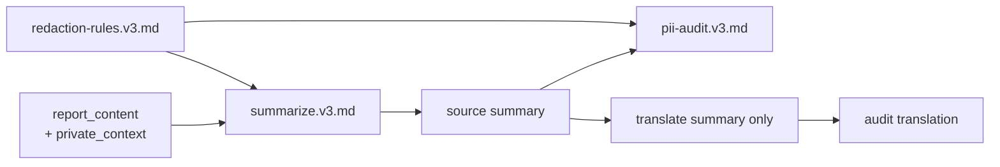

# Runtime prompts

These are versioned application assets sent to models processing real reports.
They are not developer instructions or agent skills.

## Current contract

Version 3 implements ADR-0038. The Worker supplies the summarizer with two
structurally separate sections:

- `report_content`: non-private labeled fields and the only eligible summary
  facts;
- `private_context`: private labeled fields used only to recognize and remove
  identifiers from report content.

The PII auditor receives only a candidate summary. The translator receives only
the anonymized source summary. Neither receives private context.

Text anonymization is performed exclusively by the summarization LLM. There is
no deterministic scrub or regex redaction pass. Deterministic media validation
and metadata removal are separate from these prompts.

## Versioning

`summarize.v3.md`, `pii-audit.v3.md`, and `redaction-rules.v3.md` are current.
Versions 1 and 2 remain frozen so historical summaries remain explainable;
their descriptions of the retired deterministic pipeline are historical, not
the current design.

Every generated summary records its model and prompt version. Add a new version
instead of editing an existing file whenever output behaviour could change.
Each summarizer and auditor includes the matching rules version.

## Changing prompts

A prompt change affects what may be published about real accidents:

- add, never overwrite, a version;
- test input partitioning and recorded model behaviour with synthetic data;
- assert identifying input is absent and useful non-private facts survive;
- test both official languages;
- run `agents/anonymization-auditor.md` on the committed diff.

See `docs/anonymization-policy.md`, `docs/aircraft-classification.md`, and
ADR-0038.
