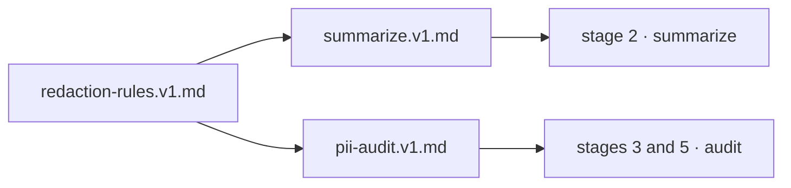

# Runtime prompts

These files are **application assets, not developer documentation and not agent
skills.** They are loaded by `HpacSafety.Worker` at runtime and sent to the model
as part of processing an incoming report.

The distinction matters. A `SKILL.md` under `skills/` shapes how an AI agent
*writes this codebase*. A prompt here shapes what the model does to a *real
pilot's accident report* in production. Redaction rules belong in this second
category — they are part of the request, and they ship with the application.

## Versioning

Filenames carry a version: `summarize.v1.md`, `pii-audit.v1.md`.

`summaries.prompt_version` and `summaries.model` are stamped on every generated
row, so any published summary can be traced back to exactly what produced it.

**Bump the version rather than editing in place** whenever the change could
alter output. Old versions stay in the repository — a summary generated last
year must remain explicable.

## Composition

`redaction-rules.v1.md` is shared text included by both prompts, so the rules
cannot drift between the summarizer and the auditor. The loader composes:

## Changing these files

A prompt change is a change to what gets published about real accidents. Treat
it as you would a change to redaction code:

- Bump the version.
- Run the golden-file suite in `tests/HpacSafety.Anonymization.Tests`.
- Have `agents/anonymization-auditor.md` review the diff — it specifically
  checks for instructions softened from "never" to "avoid".

## Related

- `docs/anonymization-policy.md` — the policy these prompts implement
- `docs/aircraft-classification.md` — the class vocabulary they use
