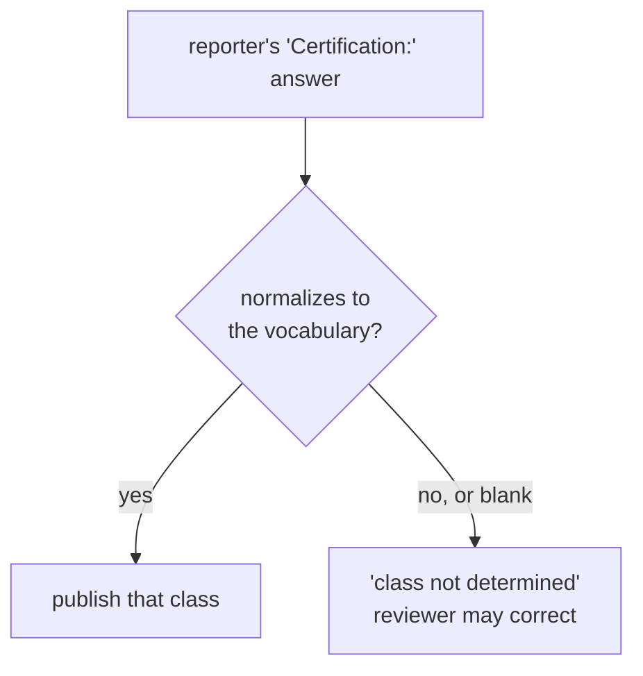

# Describing an aircraft without identifying it

A published summary says **"a high EN-B glider"**. It never says "an Ozone Rush 6".

Manufacturer and model are collected and retained privately — HPAC needs them
for trend analysis, and a pattern across one model is exactly the kind of thing
a reporting system should surface. They are simply never published, because the
wing a pilot flies is a strong identifier within a local community.

## Where the class comes from

**The reporter tells us.** The form asks for the aircraft's certification, and
that answer is the only source. There is no lookup table mapping models to
classes, and nothing in this system derives a class from a model name.

That is a deliberate simplification, and it is the safer design:

- The pilot knows what they were flying. A table would be a second-hand guess
  at something the reporter can state first-hand.
- A model-to-class table is a permanent maintenance burden — hundreds of wings,
  new certifications every season, and per-size differences.
- A stale or wrong table row publishes a confident, wrong, permanent fact about
  a real accident.

**An AI never infers the class either.** Not from the model name, not from the
narrative, not from the pilot's rating. If the reporter's answer cannot be
normalized to the vocabulary below, the outcome is `class not determined` — a
perfectly acceptable result that a reviewer can correct by hand.

## Vocabulary

### Paragliders — EN 926-2 / LTF class, with a band

| Published as | Notes |
|---|---|
| `EN-A` | |
| `low EN-B` | The B band carries most of the safety signal — do not collapse it |
| `high EN-B` | |
| `EN-C` | |
| `EN-D` | |
| `CCC` | Competition class |
| `uncertified` | Prototypes, expired certification, out-of-weight-range |

The low/high B distinction matters more than anything else in this table. "EN-B"
alone spans nearly the whole recreational market and tells a reader almost
nothing.

### Hang gliders — structural class

Hang gliders are not EN-rated, so the paraglider vocabulary does not transfer.
HPAC covers both disciplines and a summary must be equally meaningful for each.

| Published as |
|---|
| `single-surface` |
| `double-surface kingposted` |
| `topless` |
| `rigid` |

### Mini wings and speedwings

Published as `mini wing` or `speedwing`, with the EN class if the wing carries
one and `uncertified` if it does not.

### Tandems

The discipline carries the tandem marker — `tandem paraglider`, `tandem hang
glider` — alongside the class where one exists.

## Normalizing the answer

The Typeform collects `Certification:` as free text, so today's answers vary:
`"EN B"`, `"low B"`, `"LTF 1-2"`, `"B (high)"`, `"topless"`, `"n/a"`.

`IAircraftClassifier` normalizes that string against the vocabulary — case,
punctuation, and common spellings — and returns the class or the unknown state.
It never returns a guess.

**Preferred fix at the source:** the new form should ask for certification as a
*selection* from the vocabulary above, scoped to the aircraft type the reporter
already chose, with a free-text escape hatch. That turns normalization from a
parsing problem into a validation problem, and every future report arrives clean.
Free-text normalization still has to exist for the historical shape of the
question.

## Related

- `prompts/redaction-rules.v1.md` — the runtime redaction rules
- `docs/aircraft-classification.md` — the policy
- `docs/form-spec.md` — the aircraft fields as the reporter sees them
