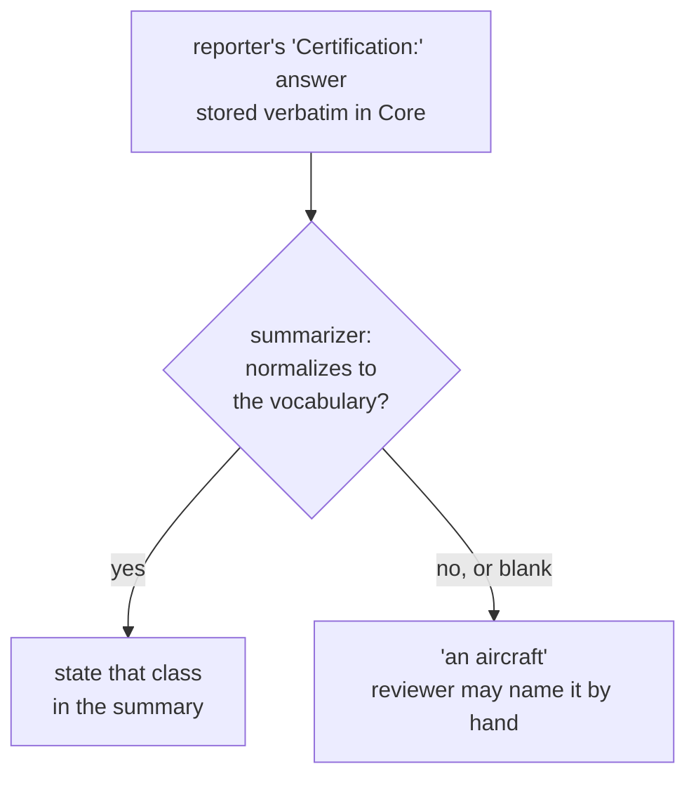

# Describing an aircraft without identifying it

A published summary says **"a high EN-B glider"**. It never says "an Ozone Rush 6".

Manufacturer and model are collected and retained privately — HPAC needs them
for trend analysis, and a pattern across one model is exactly the kind of thing
a reporting system should surface. They are simply never published, because the
wing a pilot flies is a strong identifier within a local community.

## Where the class comes from

**The reporter tells us.** The form asks for the aircraft's certification, and
that answer is the only source. There is no lookup table mapping models to
classes, and nothing in this system derives a class from a model name.

That is a deliberate simplification, and it is the safer design:

- The pilot knows what they were flying. A table would be a second-hand guess
  at something the reporter can state first-hand.
- A model-to-class table is a permanent maintenance burden — hundreds of wings,
  new certifications every season, and per-size differences.
- A stale or wrong table row publishes a confident, wrong, permanent fact about
  a real accident.

**Nothing infers the class from the model name, the narrative, or the pilot's
rating either.** The only input is the reporter's own certification answer. If
it cannot be normalized to the vocabulary below, the outcome is "an aircraft" —
a perfectly acceptable result that a reviewer can name by hand before
publication.

`HpacSafety.Core` does not do this normalization. The reporter's certification
answer is non-private `report_content`; aircraft make and model are separate
`private_context` fields. The summarizer determines the class only from the
certification answer and selected aircraft type under `prompts/summarize.v3.md`,
composed with `prompts/redaction-rules.v3.md`.
See [ADR-0036](../../docs/decisions/ADR-0036-classification-moves-to-the-summarization-prompt.md).

## Vocabulary

### Paragliders — EN 926-2 / LTF class, with a band

| Published as | Notes |
|---|---|
| `EN-A` | |
| `low EN-B` | The B band carries most of the safety signal — do not collapse it |
| `high EN-B` | |
| `EN-B` | The reporter gave no band. Published as-is, never widened into one |
| `EN-C` | |
| `EN-D` | |
| `CCC` | Competition class |
| `uncertified` | Prototypes, expired certification, out-of-weight-range |

The low/high B distinction matters more than anything else in this table. "EN-B"
alone spans nearly the whole recreational market and tells a reader almost
nothing.

That is an argument for **asking** for the band — the selection-scoped
certification question — not for discarding a bare `EN-B` a reporter actually
gave. Plain `EN-B` is its own class, and the three values never convert into one
another in either direction.

### Hang gliders — structural class

Hang gliders are not EN-rated, so the paraglider vocabulary does not transfer.
HPAC covers both disciplines and a summary must be equally meaningful for each.

| Published as |
|---|
| `single-surface` |
| `double-surface kingposted` |
| `topless` |
| `rigid` |
| `uncertified` |

`uncertified` is the one term both vocabularies share — uncertified hang gliders
exist. It is the fallback within the hang glider vocabulary, so
`"topless, uncertified"` is `topless`: the structural class is the more useful
answer where the reporter gave one.

### Mini wings and speedwings

Published as `mini wing` or `speedwing`, with the EN class if the wing carries
one and `uncertified` if it does not.

### Tandems

The discipline carries the tandem marker — `tandem paraglider`, `tandem hang
glider` — alongside the class where one exists.

## Normalizing the answer

The Typeform collects `Certification:` as free text, so today's answers vary:
`"EN B"`, `"low B"`, `"LTF 1-2"`, `"B (high)"`, `"topless"`, `"n/a"`.

The summarizer normalizes that string against the vocabulary — case,
punctuation, and common spellings — and states the class or says nothing about
it. It never states a guess. Two things about this are load-bearing, and both
are prompt instructions rather than code, per ADR-0036:

- **It reads two inputs only** — the reporter's verbatim certification answer
  and the aircraft type they chose. Not the make, not the model, not the
  narrative, not the pilot's rating. Manufacturer and model are told to the
  summarizer as labeled private context only so it can recognise and remove
  them if they appear in the narrative — never as a source for the class or any
  other summary fact.
- **It is meant to be total.** Every certification answer should resolve to a
  class or to "an aircraft" — never silence about the aircraft and never an
  invented class. The redaction rules and the PII audit stage are the backstop
  if a summary states one it should not have.

### What it recognises

| The reporter wrote | It normalizes to |
|---|---|
| `EN A`, `en-a`, `EN 926 A` | `EN-A` |
| `low B`, `EN B (low)`, `low EN-B` | `low EN-B` |
| `B (high)`, `high EN B` | `high EN-B` |
| `EN C`, `en-d`, `CCC` | `EN-C`, `EN-D`, `CCC` |
| `uncertified`, `not certified`, `prototype` | `uncertified` |
| `topless`, `rigid`, `single surface`, `kingpost` | the hang glider class |
| `EN B`, `en-b`, `B`, `low or high B, not sure` | `EN-B` |
| `uncertified` (either discipline) | `uncertified` |
| `tandem, high EN-B` | `high EN-B` plus the tandem marker |
| `mini wing, EN A` | `EN-A` plus the mini wing marker |
| `LTF 1-2`, `n/a`, `Ozone Rush 6` | `class not determined` |

### What the prompt refuses to state a class for, on purpose

- **LTF and DHV answers.** A different scheme, and how its bands map onto EN
  bands is HPAC's judgement, not the model's. Ruled on: unresolved, and a
  reviewer names it by hand. Note the contrast with a bare `EN B`, which *is*
  a value in this vocabulary and is kept.
- **An EN class on a hang glider.** The vocabularies are scoped by the aircraft
  type, so the paraglider one cannot leak across.
- **A make or model.** There is no table to look it up in, and stating one is
  forbidden by the redaction rules regardless of where it came from.
- **A stray letter that never named a certification.** Ordinary prose is full of
  the article "a", a contraction can split into a bare letter ("I'd" → "i",
  "d"), and a foreign sentence can contain one by accident ("c'est un bon
  jour"). A bare `a`/`b`/`c`/`d` only names an EN letter when it is the whole
  answer, or when a certification word (`en`, `high`, `low`) sits next to it —
  the same rule `docs/aircraft-classification.md` and
  `prompts/summarize.v3.md` describe.

Refusing and discarding are different things. An answer that names a value in
this vocabulary is kept even when it is less precise than the form would like —
that is why plain `EN-B` publishes as given, and why `uncertified` reaches hang
gliders too. But a value has to actually be *named* — proximity to a
certification word, not mere presence anywhere in the sentence.

### Markers travel with the class

A tandem is still a high EN-B. The summary states both: "a tandem, high EN-B
glider". `tandem paraglider`, `tandem hang glider`, `mini wing`, and
`speedwing` are stated on their own only when no certification class resolves
alongside them.

### If you are adding to the vocabulary

Add a new summarization prompt version and update
`docs/aircraft-classification.md` together,
and add the answer shape to the controlled model-contract suite for the summarizer
(`tests/HpacSafety.Anonymization.Tests`, once #20 lands). Anything that cannot
be written as "this exact answer means this exact class" is not a
normalization — it is an inference, and the model must not attempt it either.

**Preferred fix at the source:** the new form should ask for certification as a
*selection* from the vocabulary above, scoped to the aircraft type the reporter
already chose, with a free-text escape hatch. That turns normalization from a
parsing problem into a validation problem, and every future report arrives clean.
Free-text interpretation by the summarizer still has to exist for the historical
shape of the question.

## Related

- `prompts/summarize.v3.md` — where the class is actually determined
- `prompts/redaction-rules.v3.md` — the runtime redaction rules
- `docs/aircraft-classification.md` — the policy
- [ADR-0036](../../docs/decisions/ADR-0036-classification-moves-to-the-summarization-prompt.md) — why this moved out of `Core`
- `docs/form-spec.md` — the aircraft fields as the reporter sees them
