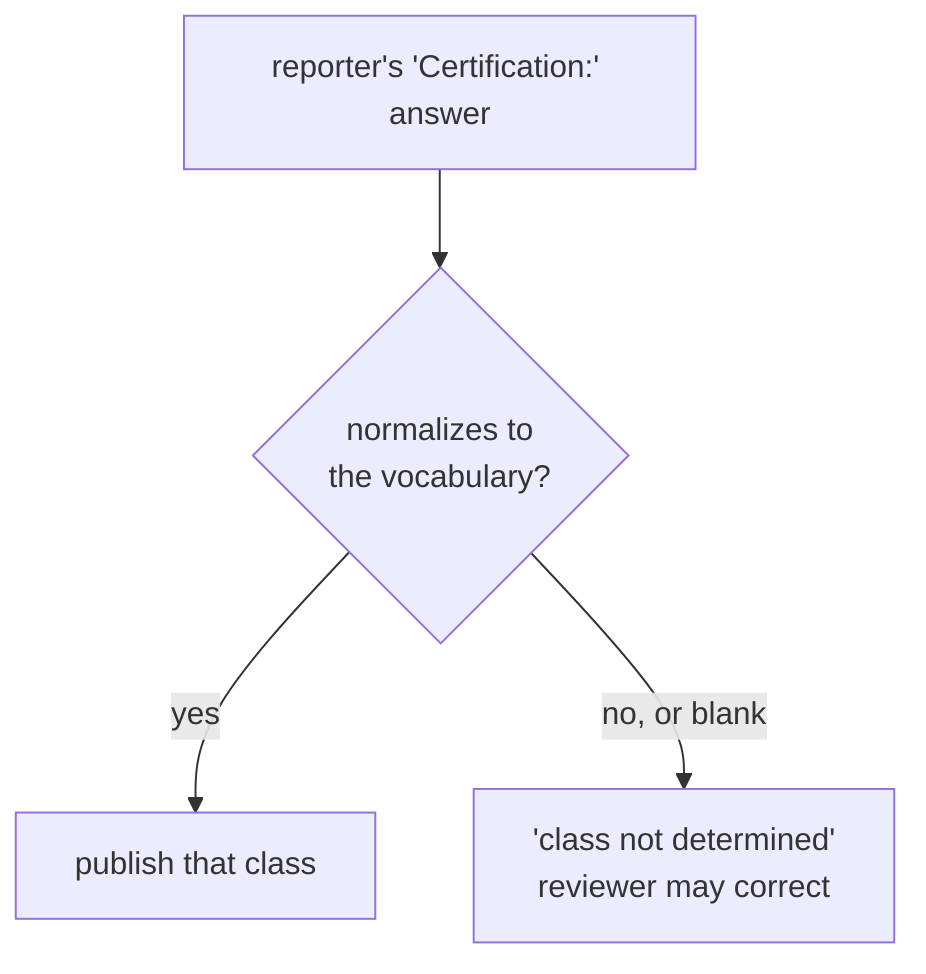

# Describing an aircraft without identifying it

A published summary says **"a high EN-B glider"**. It never says "an Ozone Rush 6".

Manufacturer and model are collected and retained privately — HPAC needs them
for trend analysis, and a pattern across one model is exactly the kind of thing
a reporting system should surface. They are simply never published, because the
wing a pilot flies is a strong identifier within a local community.

## Where the class comes from

**The reporter tells us.** The form asks for the aircraft's certification, and
that answer is the only source. There is no lookup table mapping models to
classes, and nothing in this system derives a class from a model name.

That is a deliberate simplification, and it is the safer design:

- The pilot knows what they were flying. A table would be a second-hand guess
  at something the reporter can state first-hand.
- A model-to-class table is a permanent maintenance burden — hundreds of wings,
  new certifications every season, and per-size differences.
- A stale or wrong table row publishes a confident, wrong, permanent fact about
  a real accident.

**An AI never infers the class either.** Not from the model name, not from the
narrative, not from the pilot's rating. If the reporter's answer cannot be
normalized to the vocabulary below, the outcome is `class not determined` — a
perfectly acceptable result that a reviewer can correct by hand.

## Vocabulary

### Paragliders — EN 926-2 / LTF class, with a band

| Published as | Notes |
|---|---|
| `EN-A` | |
| `low EN-B` | The B band carries most of the safety signal — do not collapse it |
| `high EN-B` | |
| `EN-B` | The reporter gave no band. Published as-is, never widened into one |
| `EN-C` | |
| `EN-D` | |
| `CCC` | Competition class |
| `uncertified` | Prototypes, expired certification, out-of-weight-range |

The low/high B distinction matters more than anything else in this table. "EN-B"
alone spans nearly the whole recreational market and tells a reader almost
nothing.

That is an argument for **asking** for the band — the selection-scoped
certification question — not for discarding a bare `EN-B` a reporter actually
gave. Plain `EN-B` is its own class, and the three values never convert into one
another in either direction.

### Hang gliders — structural class

Hang gliders are not EN-rated, so the paraglider vocabulary does not transfer.
HPAC covers both disciplines and a summary must be equally meaningful for each.

| Published as |
|---|
| `single-surface` |
| `double-surface kingposted` |
| `topless` |
| `rigid` |
| `uncertified` |

`uncertified` is the one term both vocabularies share — uncertified hang gliders
exist. It is the fallback within the hang glider vocabulary, so
`"topless, uncertified"` is `topless`: the structural class is the more useful
answer where the reporter gave one.

### Mini wings and speedwings

Published as `mini wing` or `speedwing`, with the EN class if the wing carries
one and `uncertified` if it does not.

### Tandems

The discipline carries the tandem marker — `tandem paraglider`, `tandem hang
glider` — alongside the class where one exists.

## Normalizing the answer

The Typeform collects `Certification:` as free text, so today's answers vary:
`"EN B"`, `"low B"`, `"LTF 1-2"`, `"B (high)"`, `"topless"`, `"n/a"`.

`IAircraftClassifier` normalizes that string against the vocabulary — case,
punctuation, and common spellings — and returns the class or the unknown state.
It never returns a guess.

`VocabularyAircraftClassifier` in `HpacSafety.Core.Features.Reporting` is the
whole implementation. Three things about its shape are load-bearing:

- **It is synchronous.** An implementation that had to await something would be
  reaching for a model or a lookup service, and both are forbidden. The
  signature is where that rule is enforced, not a comment. See ADR-0029.
- **It reads two inputs only** — the reporter's verbatim answer and the aircraft
  type they chose. Not the make, not the model, not the narrative, not the
  pilot's rating.
- **It is total.** Every input yields a class or `NotDetermined`. There is no
  exception path and no default class.

### What it recognises

| The reporter wrote | It normalizes to |
|---|---|
| `EN A`, `en-a`, `EN 926 A` | `EN-A` |
| `low B`, `EN B (low)`, `low EN-B` | `low EN-B` |
| `B (high)`, `high EN B` | `high EN-B` |
| `EN C`, `en-d`, `CCC` | `EN-C`, `EN-D`, `CCC` |
| `uncertified`, `not certified`, `prototype` | `uncertified` |
| `topless`, `rigid`, `single surface`, `kingpost` | the hang glider class |
| `EN B`, `en-b`, `B`, `low or high B, not sure` | `EN-B` |
| `uncertified` (either discipline) | `uncertified` |
| `tandem, high EN-B` | `high EN-B` plus the tandem marker |
| `mini wing, EN A` | `EN-A` plus the mini wing marker |
| `LTF 1-2`, `n/a`, `Ozone Rush 6` | `class not determined` |

### What it refuses, on purpose

- **LTF and DHV answers.** A different scheme, and how its bands map onto EN
  bands is HPAC's judgement, not the classifier's. Ruled on: undetermined, and a
  reviewer converts it by hand. Note the contrast with a bare `EN B`, which *is*
  a value in this vocabulary and is kept.
- **An EN class on a hang glider.** The vocabularies are scoped by the aircraft
  type, so the paraglider one cannot leak across.
- **A make or model.** There is no table to look it up in.

Refusing and discarding are different things. An answer that names a value in
this vocabulary is kept even when it is less precise than the form would like —
that is the `EN-B` ruling in ADR-0029, and the reason `uncertified` reaches hang
gliders too.

### Markers travel with the class

A tandem is still a high EN-B. The result is an `AircraftClassification` — a
class plus `AircraftMarker` flags — rendered as invariant codes such as
`["tandem", "high_en_b"]`. The `tandem paraglider`, `tandem hang glider`,
`mini wing` and `speedwing` members of `AircraftClass` stand in as the class
only when no certification class was determined. See ADR-0030.

### If you are adding to the vocabulary

Add the answer shape and its expected class to
`tests/HpacSafety.Core.Tests/AircraftClassifierTests.cs` first, watch it fail,
then add the phrase. Anything that cannot be written as "this exact answer means
this exact class" is not a normalization — it is an inference, and it does not
belong here.

**Preferred fix at the source:** the new form should ask for certification as a
*selection* from the vocabulary above, scoped to the aircraft type the reporter
already chose, with a free-text escape hatch. That turns normalization from a
parsing problem into a validation problem, and every future report arrives clean.
Free-text normalization still has to exist for the historical shape of the
question.

## Related

- `prompts/redaction-rules.v1.md` — the runtime redaction rules
- `docs/aircraft-classification.md` — the policy
- `docs/form-spec.md` — the aircraft fields as the reporter sees them
