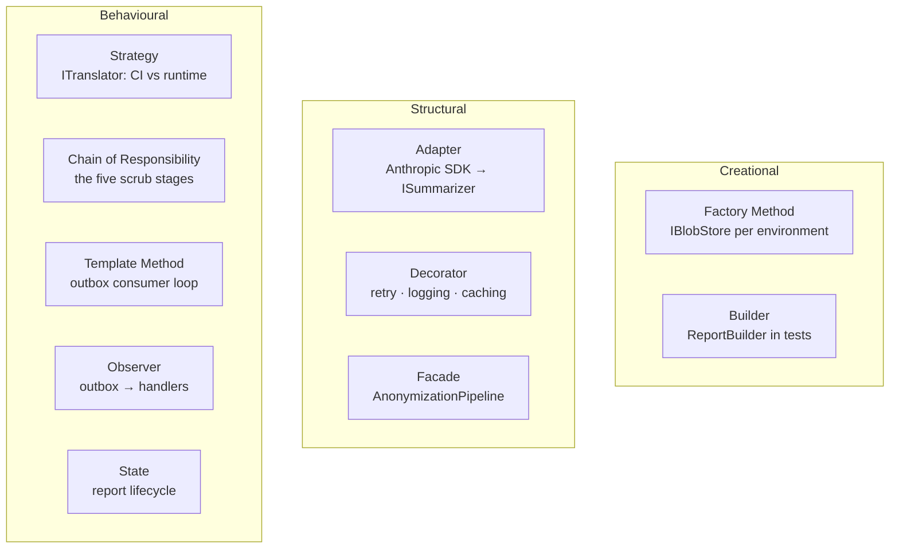

# Gang of Four patterns

Patterns are a **vocabulary**, not a checklist. Their value is that a reviewer
reading `SummaryStrategy` or `ReportBuilder` knows the shape before reading the
body. Their cost is indirection, and indirection added speculatively is a tax
paid every time someone reads the file.

The rule for this repository: **name the pattern when you use one, and be able
to say what varies.** A pattern that abstracts a variation which does not exist
is not a pattern, it is a layer.

## Where each one actually belongs here



### Creational

**Factory Method / abstract factory** — selecting `S3BlobStore` versus
`FileSystemBlobStore`, `SesEmailSender` versus `LoggingEmailSender`,
`HpacMembersProxyAuthenticator` versus `OidcAuthenticator`. In .NET this is
usually DI registration rather than a hand-written factory class, and that is
the right form: `services.AddSingleton<IBlobStore>(sp => ...)` *is* a factory
method. Write a real factory type only when the choice depends on runtime data
rather than on configuration.

**Builder** — test data. `ReportBuilder.Default().WithDescription(...)` keeps a
Given block to one line and keeps the twenty fields of a report out of every
test. This is the single highest-value pattern in the test projects; use it
before the third test that constructs a report by hand.

**Singleton** — do not hand-roll it. DI lifetimes express it, and a hand-rolled
singleton is untestable and usually not thread-safe.

### Structural

**Adapter** — every third-party SDK crosses into this codebase through one.
`ClaudeSummarizer` adapts the Anthropic client to `ISummarizer`;
`S3BlobStore` adapts the AWS SDK to `IBlobStore`. This is what makes
Dependency Inversion real: the vendor type appears in exactly one file.

**Decorator** — cross-cutting concerns that must not be written into the
adapter. Retry, structured logging, metrics, and caching each wrap the interface
they extend:

```csharp
services.AddSingleton<ISummarizer, ClaudeSummarizer>();
services.Decorate<ISummarizer, RetryingSummarizer>();
services.Decorate<ISummarizer, LoggingSummarizer>();
```

A logging decorator in this system has a hard constraint: **it logs that a call
happened and how long it took. It never logs the payload.** Report text contains
names and injuries, and a decorator is exactly where that leaks by accident.

**Facade** — `AnonymizationPipeline` is one call to the Worker and five stages
underneath. The facade is what lets the Worker stay a scheduling concern.

**Proxy** — the `members.hpac.ca` credential proxy is literally this: a stand-in
that speaks the same interface as the eventual OIDC implementation. See
`docs/authentication.md`.

### Behavioural

**Strategy** — `ITranslator` has two implementations that differ by *where they
run*: the CI job uses GitHub Models with the runner's token, the Worker uses the
Anthropic client it already holds. One interface, two registrations, no shared
code. This is the textbook case and it earns its keep.

**Chain of Responsibility** — the five anonymization stages. Each stage takes
the previous stage's output and either passes it on or records a finding.
Composing them as a list means adding a stage is adding a registration, and the
pipeline test can run any prefix.

The important variant here: **a stage may flag but must not silently rewrite.**
A chain whose links can quietly mutate is a chain nobody can audit.

**Template Method** — the outbox consumer: claim, dispatch, mark processed,
back off, count attempts. That loop is identical for every message type; only
the dispatch varies. Put the loop in a base class and the handler in a subclass
or a delegate — not the loop in every handler.

**Observer / publish-subscribe** — the outbox itself, deliberately implemented
as durable rows rather than in-process events. An in-process `event` that fires
after `SaveChangesAsync` loses its subscribers when the process dies, and
"losing" here means a report about a fatality never gets summarized. See
[ADR-0002](../../docs/decisions/ADR-0002-transactional-outbox.md).

**State** — the report lifecycle. Whether it is a `switch` on an enum or a set
of state types depends on how much behaviour each state carries. Start with the
enum and a guarded transition method; promote to types only when the states
start owning real logic. What matters either way is that the transition function
is in **one** place, because "which transitions are legal" is a safety question.

**Specification** — publishability. `IsPublishable` is not one boolean; it is
consent AND approval AND both PII audits clean AND both languages present.
Naming that composition as a specification keeps it out of the UI, out of the
API, and out of the publication channel, where three copies would drift.

## Patterns to be suspicious of here

| Pattern | Why to hesitate |
|---|---|
| **Abstract Factory** | Usually DI already. A factory-of-factories needs a real second product family before it earns the name. |
| **Visitor** | Powerful over a stable type hierarchy. This domain's types are still moving; a visitor freezes them early. |
| **Mediator** | An in-process mediator over an already-explicit call graph mostly hides the call graph. The outbox is the messaging boundary that matters. |
| **Flyweight / Prototype** | No allocation pressure here justifies either. |
| **Command** | Fine as a shape, but if it becomes a hand-rolled undo stack, stop — the audit log is the record of what happened. |

## Naming

Use the pattern's own noun as a suffix when the type *is* the pattern:
`RetryingSummarizer` (decorator), `SummaryStrategy`, `ReportBuilder`,
`AnonymizationPipeline` (facade). A reviewer should not have to read the body to
learn the shape.

Do **not** suffix a type with a pattern it merely resembles. `ReportManager`,
`SummaryHelper`, and `AnonymizationService` all describe nothing; if the right
noun is hard to find, the responsibility is probably not single.

## Related

- [`solid-principles`](../solid-principles/SKILL.md) — the principles these
  patterns serve. Reach for a pattern because a principle is under strain, not
  the other way round.
- `dotnet-design-pattern-review` (upstream, `github/awesome-copilot`) — review
  checklist for pattern misuse in .NET.
- `docs/architecture.md`, `docs/decisions/`.
