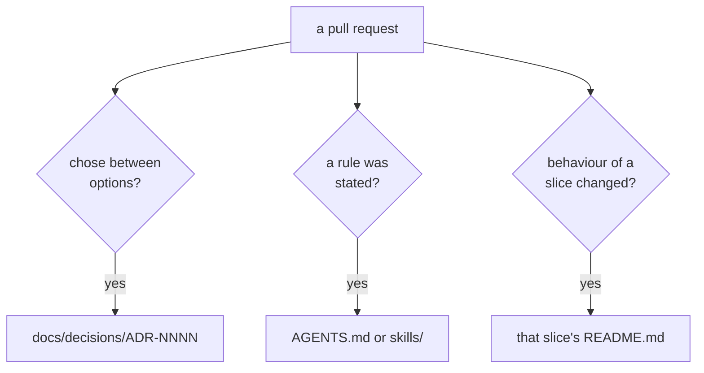

# Conventions

## Diagrams — Mermaid, never ASCII

Every diagram in this repository is a Mermaid fence: READMEs, skills, docs,
ADRs, PR descriptions. GitHub renders Mermaid natively, and an agent can edit a
Mermaid graph in a way it cannot edit a box-drawing diagram. CI fails on stray
box-drawing characters in markdown.

## Tests

**Shouldly, always.** Not `Assert.*`, not FluentAssertions. Shouldly's failure
messages name the expression under test, which matters when the reader is an
agent looking at a CI log rather than a person at a debugger.

This is enforced, not requested: `Xunit.Assert` is in `tests/BannedSymbols.txt`
and `RS0030` is an error, so it fails in the editor and in a local build. If a
test genuinely needs it, `#pragma warning disable RS0030` with a comment — which
is visible in review, and that is the point.

**Given/When/Then**, in the name and marked in the body:

```csharp
[Fact]
public async Task Given_a_report_with_no_publication_consent_When_it_is_approved_Then_it_is_not_publishable()
{
    // Given
    var report = ReportBuilder.Default().WithConsent(false);
    // When
    await _moderation.ApproveAsync(report.Id);
    // Then
    report.IsPublishable.ShouldBeFalse();
}
```

JavaScript uses `node:test` with nested `describe` blocks producing the same
sentence. Playwright is E2E only.

Coverage is gated at 80% line / 70% branch and ratchets upward — but it is a
floor, not a goal. This repository can be at 95% and still publish someone's
phone number. The anonymization suite is what actually matters.

## Strings

**No user-facing literal ever appears in code.** Not in the admin UI, not in a
validation message, not in an `aria-label`, not in an email subject line. Add a
key to `locales/en-CA.json`.

French is generated in CI and reviewed by a human — never hand-edit
`locales/fr-CA.json`. Terms in `locales/glossary.json` are pinned and must not
be machine-translated.

## Layout

| Path | Contains |
|---|---|
| `src/HpacSafety.Core` | Domain and interfaces. **Depends on nothing.** |
| `src/HpacSafety.Infrastructure` | EF Core, HTTP clients, Anthropic, blob storage |
| `src/HpacSafety.Api` | ASP.NET Core Web API |
| `src/HpacSafety.Worker` | Outbox consumer: summarize, translate, notify |
| `src/web` | Static HTML/JS. No SPA framework, no bundler. |
| `locales/` | The single source of user-facing strings |
| `docs/` | Design, policy, ADRs |
| `skills/`, `agents/` | Sources for `skillfile install` |

If a dependency arrow would point out of `Core`, the abstraction belongs in
`Core` and the implementation in `Infrastructure`.

## Never assume — ask

If a requirement has a gap, stop and ask before implementing. Do not guess, do
not infer, do not pick the likeliest reading and carry on. The line is whether a
different answer would change the work: a variable name is routine judgement, an
ambiguous redaction rule is not. Anything touching the anonymization pipeline,
the prompts, or what gets published has no acceptable guess.

Ask before implementing, ask everything in one round, and do the parts that do
not depend on the answer first. If genuinely blocked and you must proceed, write
the assumption down in the pull request body and in the code, marked.

Full rule, including when *not* to ask: `AGENTS.md`, "Never assume. Ask."

## Documentation ships with the change

Three rules, and they hold **even when the trigger is outside the scope of the
current task**. That is exactly when knowledge gets lost.

**Every decision gets an ADR.** `docs/decisions/ADR-NNNN-<slug>.md`, numbered
sequentially, never renumbered, never deleted. A reversal is a new ADR that
supersedes the old one, because the reasoning behind the reversal is the part
worth keeping. Record what was rejected and why — an ADR listing only the winner
is a press release. Warranted whenever someone could ask "why is it like that?"
six months from now; not warranted for a naming or formatting preference.

**Every requirement lands somewhere durable**, in the same PR it was stated in:

| The rule is about | Write it in |
|---|---|
| How code here is written | `AGENTS.md`, or a `skills/` skill if it needs room |
| What the running system does | `docs/`, plus an ADR if a choice was made |
| What the model is sent at runtime | `prompts/`, versioned — never a skill |

**Every vertical slice has a README, updated in the PR that changes it.** Every
project, every namespace with real behaviour, every feature area. It states what
the slice is for, what it owns, what it deliberately does not own, how it is
exercised, and how it deploys if it is deployable. The READMEs under `src/` are
the model. A README that no longer describes its slice is worse than none,
because it is believed.



## Pull requests

- `main` is protected. Every change goes through a PR with one approval from a
  repository administrator.
- Squash merge only; the PR title becomes the commit message.
- One issue per PR where practical.
- **Every PR closes an issue.** `Closes #123` in the body, on its own line. The
  `linked-issue` CI check enforces it; `See #123` does not count. GitHub has no
  setting for this — the keyword in the body, which becomes the squash commit
  message, is the only mechanism.
- The PR template asks whether the change touches anonymization or PII handling.
  Answer it honestly — that question routes reviewer attention.
- No `Co-Authored-By` trailers.
- Do not create a `CODEOWNERS` file. Approver management lives on the repository
  access page precisely so that changing it does not require a PR.

## Generated files — never hand-edit

| File | Regenerate with |
|---|---|
| `docs/form-spec.md` | `tools/extract-typeform.py` |
| `locales/fr-CA.json` | `tools/translate-locale.mjs` (in CI) |
| `.claude/skills/`, `.claude/agents/` | `skillfile install` |
| `src/web/styles/site.css` | `tools/build-css.sh` |

## Related

- `AGENTS.md` — the invariants, which outrank anything here
- `docs/testing-conventions.md`
- `docs/localization.md`
