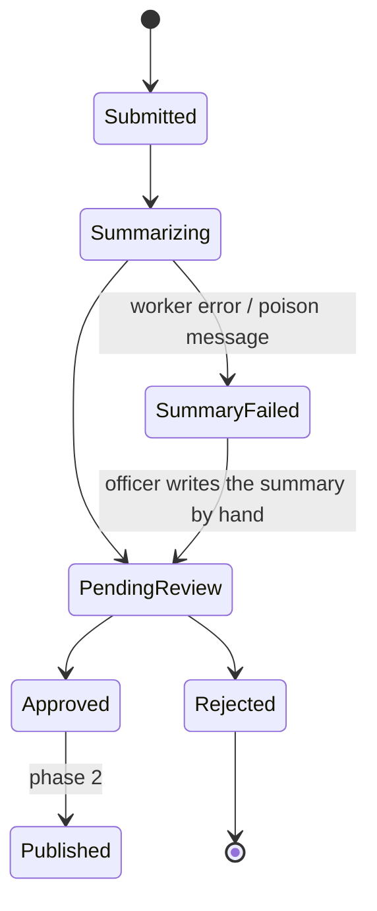
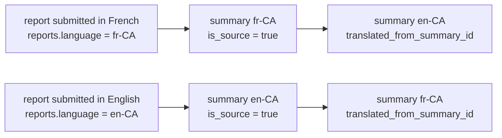
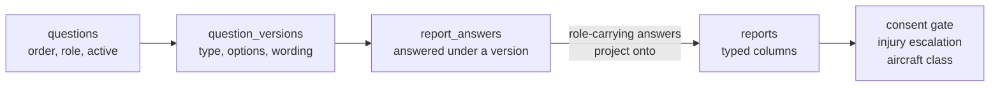

# Domain model

## Lifecycle

`SummaryFailed` exists so that a report can never become invisible. If the model
is down, the API key is wrong, or a message poisons the queue, the report still
lands in front of a human with the error attached. A safety officer can always
write the summary manually.

## Tables

| Table | Holds |
|---|---|
| `questions` | The question bank — key, order, active, role, sensitivity. Edited by an administrator, not by a deploy. |
| `question_versions` | A question exactly as it was asked: type, required, option set, wording. Immutable. |
| `question_options` | One row per choice, with an invariant `code`. Never display text. |
| `question_translations` | Question wording per locale. `is_source` marks the language a human wrote; `is_machine_translated` marks text nobody has reviewed. |
| `question_option_translations` | The same, for choices. |
| `report_answers` | One answer to one **version** of a question. |
| `reports` | The submission. Contact fields encrypted, admin-read only. `consent_publish` gates publication. **`language`** records the locale the reporter actually wrote in — see below. |
| `report_aircraft` | One row per aircraft involved; make/model private, class/band published. |
| `report_files` | Blob keys for uploads, plus `exif_stripped_at`. |
| `summaries` | One row **per language**. `is_source` marks the one generated from the report; the other carries `translated_from_summary_id`. |
| `outbox_messages` | Work to be done, written in the same transaction as the report. |
| `admin_users` | The authorization allowlist. Authentication is upstream; roles are ours. |
| `audit_log` | Who approved, edited, or rejected what, and when. |

## Language, and why `reports.language` exists

A report submitted in French is stored in French. The raw narrative is never
translated — it is the reporter's own account, and a translated account of a
crash is a paraphrased account of a crash.

`reports.language` records the locale the report was written in, and it drives
three things downstream:

1. The summarizer summarizes **in that language**. A French report produces a
   French summary first.
2. The summary is then translated into the other official language, so both
   `en-CA` and `fr-CA` versions exist for every report regardless of which one
   it came in as.
3. The reporter's confirmation email is sent in that language, while an
   officer's alert follows the officer's own locale.

`summaries` therefore holds one row per language. `is_source` marks the one
generated directly from the report; the other carries
`translated_from_summary_id`. Keep that distinction visible in the admin UI —
a reviewer should know whether they are reading the original summary or a
translation of it, because the two fail in different ways.

## The question set is data

The form is a table, not a class. An administrator adds, rewords, retypes,
reorders, and removes questions without a deploy — see
[ADR-0016](../../docs/decisions/ADR-0016-data-driven-question-bank.md).

Three rules to keep straight when working here:

1. **An answer references a version, never a question.** Rewording tomorrow must
   not change what an answer given today appears to mean. Reordering and
   activation are *not* versioned; neither changes meaning.
2. **`consent_publish` is the only system question.** Undeletable, undeactivatable,
   untypeable-away. `Report.ConsentPublish` is `bool?` — **null is unanswered,
   which is not no.** The question is required with no default, and a report
   cannot be submitted until a reporter picks yes or no. `YesNo` is a fixed
   two-answer type; it cannot be given a third option.
3. **Everything else finds its answer through an optional `QuestionRole`.**
   Injury, date, province, aircraft. A role can be moved or cleared, and its
   absence is a defined state: no injury question means severity is
   `NotAnswered` and the report takes the ordinary review path rather than the
   escalated one. Never treat a missing role as a zero.

Question wording lives in `question_translations`, not in `locales/`, because it
is authored at runtime. It is auto-translated into the other official language
through `ITranslator` at authoring time, in both directions, and a question
cannot be activated with a missing counterpart. UI chrome keeps its CI
translation pipeline — see `docs/localization.md`.

## The outbox

The API writes the report and its outbox row in **one** `SaveChangesAsync`.
There is no "save, then call the worker" — that loses reports whenever the
process dies between the two.

The worker claims rows with `SELECT ... FOR UPDATE SKIP LOCKED`, applies
exponential backoff, and moves a message aside after a poison threshold rather
than retrying it forever. Polling is the source of truth; Postgres
`LISTEN/NOTIFY` may be layered on later purely to cut latency, never as the only
delivery mechanism.

Everything asynchronous rides the same outbox: summarization, translation, and
notification emails. An email failure must never roll back a report submission.

## Sensitivity

Three tiers, and the distinction drives access control, logging, and what may
be sent to a model:

A question carries its own tier, and a new question is **Restricted** until
someone decides otherwise. An answer copies the tier it was given under, so
reclassifying a question later cannot downgrade the handling of text a reporter
already trusted us with.

1. **Restricted** — reporter and pilot names, phone, email, member number, raw
   narrative, original uploaded media. Encrypted at rest, admin-only,
   never logged, never sent to a translation service.
2. **Internal** — manufacturer, model, precise site. Used for HPAC's own trend
   analysis; never published.
3. **Publishable** — the approved summary, certification class, province,
   severity at the scale level, month and year.

A field's tier is a property of the field, not of the screen it appears on. If
you are unsure which tier something belongs to, it is Restricted.

## Enums

Stored as stable invariant codes, localized only at the edge. Never store
display text in the database — the same row has to render in English and French.

## Related

- `docs/form-spec.md` — the source of the field set
- `docs/data-handling.md` — retention, encryption, PIPEDA
- `prompts/README.md` — what happens between `Submitted` and `PendingReview`
