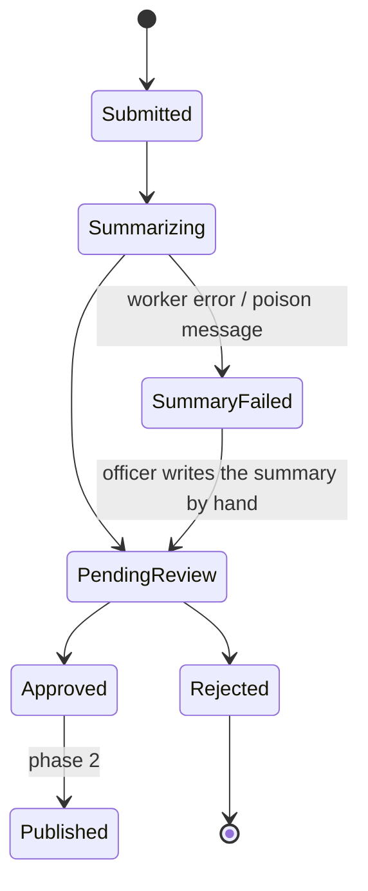

# Domain model

## Lifecycle



`SummaryFailed` exists so that a report can never become invisible. If the model
is down, the API key is wrong, or a message poisons the queue, the report still
lands in front of a human with the error attached. A safety officer can always
write the summary manually.

## Tables

| Table | Holds |
|---|---|
| `questions` | Stable question identity: key, role, privacy, order, section, active/deleted state. |
| `question_revisions` | Complete, immutable bilingual revisions of a question — wording, type, required flag. Answers reference a revision, never the question row. |
| `question_revision_options` | Choices on a revision, complete in both languages. |
| `reports` | The submission. Only `consent_publish` projects onto a typed property; every other answer lives in `report_answers`. **`language`** records the locale the reporter actually wrote in — see below. |
| `report_answers` | One row per question asked, referencing the exact revision it was answered under. |
| `report_files` | Blob keys for uploads, an `AttachmentKind`, and (once wired up) the file-upload answer they belong to. |
| `summaries` | **One row per report**, holding `ai_summary_en`, `ai_summary_fr`, shared model/prompt provenance, and one approval covering the pair. |
| `outbox_messages` | Work to be done, written in the same transaction as the report. |
| `admin_users` | The authorization allowlist. Authentication is upstream; roles are ours. |
| `audit_log` | Who approved, edited, or rejected what, and when. The one table with no `Deleted` column — it is append-only. |

Every table above except `audit_log` has a `Deleted timestamptz` column and a
default live-row query filter. See ADR-0040.

## Language, and why `reports.language` exists

A report submitted in French is stored in French. The raw narrative is never
translated — it is the reporter's own account, and a translated account of a
crash is a paraphrased account of a crash.

`reports.language` records the locale the report was written in. The Worker
makes exactly one model call using that locale and receives both official
languages back in the same response — there is no separate translation step,
and therefore no separate row or approval per language. `summaries` holds one
row per report; `AiSummaryEn`/`AiSummaryFr` are both populated by that one
call, and editing either one clears the pair's shared approval.

```mermaid
flowchart LR
    fr["report submitted in French<br/>reports.language = fr-CA"] --> call["one Worker call"]
    en["report submitted in English<br/>reports.language = en-CA"] --> call
    call --> row["one summaries row<br/>ai_summary_en + ai_summary_fr"]
```

## The outbox

The API writes the report and its outbox row in **one** `SaveChangesAsync`.
There is no "save, then call the worker" — that loses reports whenever the
process dies between the two.

The worker claims rows with `SELECT ... FOR UPDATE SKIP LOCKED`, applies
exponential backoff, and moves a message aside after a poison threshold rather
than retrying it forever. Polling is the source of truth; Postgres
`LISTEN/NOTIFY` may be layered on later purely to cut latency, never as the only
delivery mechanism. `OutboxMessage.Type` is a typed `OutboxMessageType`
(`SummarizeReport` today), stored as an invariant code like every other domain
enum; `Payload` carries identifiers only, never report content.

## Sensitivity

Three tiers, and the distinction drives access control, logging, and what may
be sent to a model:

1. **Restricted** — reporter and pilot names, phone, email, member number, raw
   narrative, original uploaded media. Admin-only, never logged, never sent to
   a translation service.
2. **Internal** — manufacturer, model, precise site. Used for HPAC's own trend
   analysis; never published.
3. **Publishable** — the approved summary and the publication timestamp. The
   public DTO is `{id, ai_summary_en, ai_summary_fr, published_at}` and
   nothing else — no province, severity, or aircraft type is ever published,
   because they are ordinary `report_answers` rows, not typed columns a public
   query could accidentally select.

A field's tier is a property of the field, not of the screen it appears on. If
you are unsure which tier something belongs to, it is Restricted.

Storage and transport encryption are AWS-managed encryption at rest and TLS —
there is no application-side field cipher (ADR-0019, superseded by ADR-0040).
Privacy is enforced by `Question.IsPrivate` controlling what reaches the
model's `report_content` section, by access control on who may query
`report_answers` at all, and by the public DTO being a positive allowlist.

## Consent is the only answer a report reads by name

Every other question — province, injury, occurrence date, aircraft, whatever
role an administrator assigns it — is simply an ordinary row in
`report_answers`. `Report` carries no typed projection for any of them: the
admin review DTO reads exact asked questions and answers directly, and nothing
downstream needs a hardcoded key to find "the injury one." `QuestionRole` has
exactly two members, `None` and `ConsentPublish`, for this reason.

## Enums

Stored as stable invariant codes, localized only at the edge. Never store
display text in the database — the same row has to render in English and French.

## Related

- `docs/data-and-persistence.md` — the canonical target schema
- `docs/decisions/ADR-0040-migrate-canonical-domain-and-persistence.md` — the migration that reached it
- `docs/form-spec.md` — the source of the field set
- `docs/data-handling.md` — retention, encryption, PIPEDA
- `anonymize-hpac-reports` — what happens between `Submitted` and `PendingReview`
