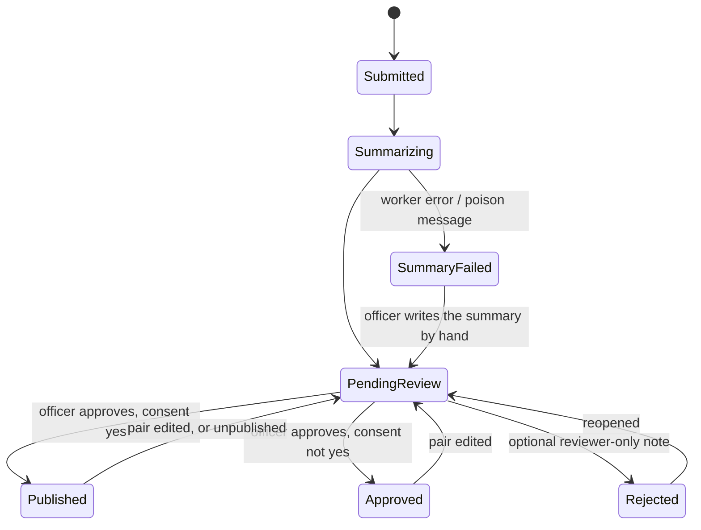

# Domain model

## Lifecycle



- Approval and publication are one officer action (ADR-0105).
- Review commands live on `Report` — `ApprovePair`, `RejectReview`, `Reopen`,
  `Unpublish`, `EditSummary`, `WriteManualSummary` — and refuse any transition
  the diagram does not allow.
- Report and summary use PostgreSQL `xmin` as row version; a command from a
  stale view gets `409`.
- **`SummaryFailed` keeps a report visible.** Model down, wrong API key, or a
  poison message: the report still reaches a human with the error attached,
  and a safety officer can always write the summary by hand.

## Tables

| Table | Holds |
|---|---|
| `questions` | Stable question identity: key, role, system flag, deleted state. |
| `question_revisions` | Complete, immutable bilingual revisions: wording, type, required, private, translatable, active, display order, dependency, grouping. Answers reference a revision, never the question row. |
| `question_choices` | A question's own editable choices, outside its revisions. Editing never forks; a reporter-added type-ahead choice may hold one language until an Administrator supplies the other (ADR-0095). |
| `reports` | The submission. Only consent projects onto typed columns (see "The consents"); every other answer is in `report_answers`. `language` is the locale the reporter wrote in. |
| `report_answers` | One row per answered value (a multi-select writes one row per chosen value), each referencing the exact revision answered. |
| `report_files` | Blob keys, an `AttachmentKind`, and the file-upload answer they belong to. |
| `summaries` | **One row per report**: `ai_summary_en`, `ai_summary_fr`, shared model/prompt provenance, one approval for the pair. |
| `outbox_messages` | Work to do, written in the same transaction as the report. |
| `audit_log` | Which token subject approved, edited, or rejected what, and when. Append-only, with no `Deleted` column. |

- **No user table.** Identity and role come from a validated bearer token per
  request and are never persisted
  ([ADR-0065](../../docs/decisions/ADR-0065-no-user-records-identity-is-the-token-subject.md)).
  An approver or audit actor is an opaque `varchar(256)` subject with no
  foreign key. A report records nothing about the member who filed it.
- Every table except `audit_log` and `pending_import_logic` (transient Typeform
  import notes, hard-deleted, ADR-0077) has `Deleted timestamptz` and a
  default live-row query filter (ADR-0040). `question_choices` has the column
  but no filter (ADR-0095).

## Language

- A report's answers are stored, immutably, in the language they were written
  in. The summary is never a translation of them. Free text whose question is
  marked Auto-translate answer (long text by default) gets a second-language
  value beside the original, made by the Worker off the submission path
  (ADR-0080, ADR-0112).
- `reports.language` is that locale. The Worker makes one model call in it and
  gets both official languages back — no separate translation step, row, or
  per-language approval.
- `AiSummaryEn` and `AiSummaryFr` both come from that call; editing either
  clears the pair's shared approval.

```mermaid
flowchart LR
    fr["report submitted in French<br/>reports.language = fr-CA"] --> call["one Worker call"]
    en["report submitted in English<br/>reports.language = en-CA"] --> call
    call --> row["one summaries row<br/>ai_summary_en + ai_summary_fr"]
```

## The outbox

- The API writes the report and its outbox row in **one** `SaveChangesAsync`.
  Never "save, then call the worker" — that loses reports when the process dies
  between the two.
- The Worker claims rows with `SELECT ... FOR UPDATE SKIP LOCKED`, backs off
  exponentially, and moves a message aside past a poison threshold.
- Polling is the source of truth. `LISTEN/NOTIFY` may be added later only to
  cut latency, never as the sole delivery.
- `OutboxMessage.Type` is a typed `OutboxMessageType` (`SummarizeReport`,
  `ProcessAttachment`, `TranslateAnswers`, `TranslateComment`), stored as an
  invariant code. `Payload` carries identifiers only,
  never report content.

## Sensitivity

Three tiers drive access control, logging, and what may reach a model:

1. **Restricted** — reporter and pilot names, phone, email, member number, raw
   narrative, original uploaded media. Admin-only and never logged.
   - The one translation service it reaches is the Worker's answer translation
     (DeepL), for free text marked Auto-translate answer (ADR-0112).
   - The one original that can become public is a validated document on a
     published report under `consent_documents`, as a forced download
     (ADR-0119).
2. **Internal** — manufacturer, model, precise site. For HPAC's own trend
   analysis; never published.
3. **Publishable** — the approved summary, publication timestamp, visible
   member comments and their count (ADR-0114), each public image or video
   derivative's opaque id and kind (ADR-0117), and each public document's
   opaque id, kind `document`, and download format (ADR-0119).
   - The public DTO is that allowlist and nothing else. No province, severity,
     or aircraft type is ever published: they are ordinary `report_answers`
     rows, not typed columns a public query could select by accident.

- A field's tier belongs to the field, not the screen. Unsure? Restricted.
- Encryption is AWS-managed at rest plus TLS; no application field cipher
  (ADR-0019, superseded by ADR-0040).
- Privacy is enforced by:
  - `Question.IsPrivate` controlling what reaches the model's
    `report_content`;
  - access control on who may query `report_answers`;
  - the public DTO being a positive allowlist.

## The consents

- The two consent questions are the only answers a report reads by name. They
  project onto `reports.consent_publish` and `reports.consent_media`
  (ADR-0117). The media-consent answer also sets `reports.consent_documents`,
  but only when it answered the question's current wording (ADR-0119).
- Every other question — province, injury, date, aircraft, any role an
  administrator assigns — is an ordinary `report_answers` row. `Report` has no
  typed projection for them; the admin review DTO reads the exact asked
  questions and answers, and nothing needs a hardcoded key.
- So `QuestionRole` has exactly `None`, `ConsentPublish`, and `ConsentMedia`.

## Enums

Stored as stable invariant codes and localized only at the edge. Never store
display text: the same row renders in English and French.

## Related

- `docs/data-and-persistence.md` — canonical target schema
- `docs/decisions/ADR-0040-migrate-canonical-domain-and-persistence.md` — the
  migration that reached it
- `docs/form-spec.md` — source of the field set
- `docs/data-handling.md` — retention, encryption, PIPEDA
- `anonymize-hpac-reports` — what happens between `Submitted` and
  `PendingReview`
