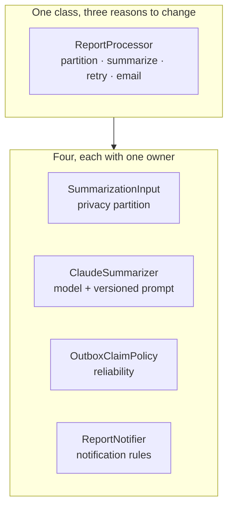
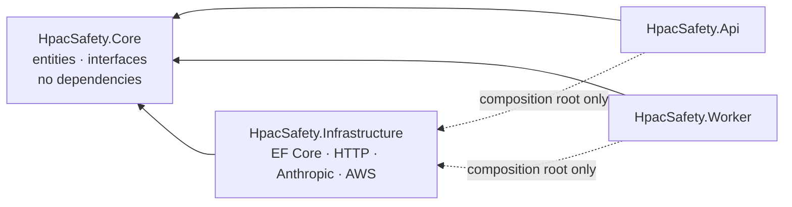

# SOLID

Every principle here is a lever for the same goal: **a change should touch one
place.** In this codebase that goal has teeth because question privacy,
model-input partitioning, and runtime prompt policy must not acquire competing
implementations.

Apply these as reasoning, not as ceremony. An interface with one implementation
that will never have a second is not Dependency Inversion; it is an extra file.

## Single Responsibility

**A class changes for one reason.** The test is not "does it do one thing" —
that is unfalsifiable — it is "who asks for a change to this file, and is it
always the same person?"

A safety officer changing model instructions and an ops engineer changing the
retry policy must not touch the same class.

The observable symptom is a test file that needs a database, an HTTP stub, and
a fixture prompt to assert one partition. When a unit test needs three
collaborators to reach one behaviour, the class has three responsibilities.

## Open/Closed

**Extend by adding a type, not by adding a `case`.** The provider adapters,
publication channels, and blob stores are all places where a new variant
arrives later. Each of those is an interface plus a registration, so adding one
is a new file and a line of DI wiring — never an edit to a `switch` that every
existing variant also flows through.

The counter-case matters as much: **the invariants in `AGENTS.md` are closed.**
There must be no extension point that lets a caller mix private fields into
`report_content`, send private context to a translator/auditor, or opt out of
human review. Open/Closed is about variation, not escape hatches.

## Liskov Substitution

**A substitute must not weaken a guarantee.** This is the principle with real
safety weight here, because `IBlobStore`, `IEmailSender`, `ITurnstileVerifier`,
and `IMemberAuthenticator` all have a development implementation standing in for
a production one.

A `FileSystemBlobStore` that skips EXIF stripping because "it's only local" is a
Liskov violation that ships an un-stripped photo the day someone points staging
at it. A `NoOpTurnstileVerifier` that returns success is correct *only* because
it is selected by configuration that production never sets — and that
configuration is itself worth a test.

Rules of thumb, in the order they usually break:

- A substitute must not throw where the contract says it returns.
- A substitute must not accept input the contract rejects — a validation that
  only the production implementation performs is a validation that does not
  exist.
- A substitute must not silently succeed where the real one would fail closed.

Write the contract's rules as tests over the *interface*, run them against every
implementation, and the violation shows up as a red test rather than as an
incident.

## Interface Segregation

**Name the interface after the caller's need.** The Worker needs
`ISummarizer.SummarizeAsync`. It has no business being handed a client that also
exposes token accounting, model listing, and streaming.

Small interfaces are also what make the substitution tests above cheap: a
one-method interface has one contract to pin down.

Splitting read from write is the usual first cut — the admin review queue reads
reports and writes decisions, and those are different permissions, different
audit consequences, and different rates of change.

## Dependency Inversion

**`HpacSafety.Core` depends on nothing.** It declares the interfaces;
`HpacSafety.Infrastructure` implements them against EF Core, HTTP, the Anthropic
SDK, and AWS. This is the one structural rule in the solution and it is not
negotiable, because it keeps the privacy partition and domain contracts
testable without a database or network. Textual anonymization belongs to the
model adapter and versioned prompts, not to a duplicate deterministic Core
implementation.

The dotted edges are the exception that proves it: `Api` and `Worker` reference
`Infrastructure` **only** in `Program.cs`, to register implementations. A
`using HpacSafety.Infrastructure;` anywhere else is the smell.

If you find yourself wanting `Core` to reference EF Core "just for the
attributes", the answer is a configuration class in `Infrastructure`, not a
reference in `Core`.

### Third-party boundaries are already a variation

Read the "plain code" rule and the adapter rule together:

- Inside the domain, keep one implementation with no named variation concrete.
- At the process edge, put every production dependency that reaches outside the
  process behind a port declared in `Core` and one adapter in `Infrastructure`.
  No other call site may name the vendor type. Swappability is sufficient; a
  second implementation need not already exist.

This boundary includes SDK and HTTP clients, blob storage, image processing,
translation, mail, and authentication. It excludes test-only libraries, the
.NET BCL, and EF Core: `DbContext` and `DbSet` already abstract persistence, and
a repository wrapper would lose useful query composition. See ADR-0033.

## When not to

- **Do not add an interface for an in-process domain type that has exactly one
  implementation and no test seam.** A value object, domain enum, or record
  stays concrete. This does not waive the mandatory adapter at a third-party
  process boundary.
- **Do not split a class because it is long.** Split it because two people ask
  for different changes to it. Length is a hint, not a reason.
- **Do not invert a dependency on the standard library.** Use the BCL's
  `TimeProvider` when time needs a test seam; do not wrap `string` or other
  platform primitives.

## Related

- [`gang-of-four-patterns`](../gang-of-four-patterns/SKILL.md) — the patterns
  that implement these principles, and when a pattern is overkill.
- `docs/architecture.md` — the project boundaries this describes.
- `AGENTS.md` — the invariants that are deliberately not extensible.
