# Domain and lifecycle

## Aggregate boundaries

The report aggregate owns its answers, files, bilingual summary pair, and
report-related outbox work for invariants and deletion. Question revisions and
admin users are separate aggregates. Audit-log entries are append-only records.
Storage objects are referenced by opaque keys but are not database entities.

## Report lifecycle

```mermaid
stateDiagram-v2
    [*] --> Submitted
    Submitted --> Summarizing: Worker claims summary job
    Summarizing --> PendingReview: valid bilingual pair saved
    Summarizing --> SummaryFailed: bounded retries exhausted
    SummaryFailed --> PendingReview: officer writes both texts
    PendingReview --> PendingReview: either text edited; approval cleared
    PendingReview --> Approved: officer approves pair
    PendingReview --> Rejected: officer rejects report
    Approved --> PendingReview: either text edited
    Approved --> Published: consent yes and report not deleted
    Published --> PendingReview: either text edited
```

Soft deletion may occur from any state and immediately removes the report from
all normal transitions, queues, admin reads, and public reads. It is a terminal
application state even though retained rows still contain their prior status.
There is no restore transition.

`SummaryFailed` is visible to safety officers; failed AI processing must never
make a report disappear. An officer may manually author both official-language
texts and move the report to pending review.

## Publication invariant

A report is publishable if and only if all of the following are true at query
time:

- the report and summary row are not deleted;
- `ConsentPublish` is exactly true;
- both English and French summary texts are nonblank;
- the pair has a current human approval; and
- the report has not been rejected.

Editing either language clears the pair's approver and approval timestamp and
immediately unpublishes it until another approval. A negative consent still
allows internal summarization and safety review but can never satisfy the
public query.

## Soft deletion

Every persisted entity/table except `audit_log` has a nullable PostgreSQL
`deleted timestamptz` column mapped from the C# property `Deleted`.
Application queries use global filters by default. Administrative investigations
that intentionally include deleted rows use an explicit unfiltered query and
remain authorized and audited.

Deleting a report runs one explicit application transaction that stamps the
same timestamp on the report and all owned/dependent rows: answers, summary,
files, and report outbox items. The transaction records an immutable audit
entry. Pending Worker work sees the deletion and stops; workers also recheck
before committing output. Public and normal admin queries hide the report
immediately.

Deleting an admin user revokes authorization and stamps `Deleted` in the same
transaction. Historical audit rows remain and may still reference that admin's
ID. `audit_log` has no `Deleted` column and no delete operation.

A question revision may be deleted only when no answer references it. The
reference check must ignore global filters, so answers belonging to deleted
reports count. Deleting an eligible revision stamps it and its option children
with one timestamp. Once any answer references a revision, that revision is
never deletable. Deactivating it through a new revision is the normal way to
remove it from future forms.

## Retention

Raw reports are retained until a safety officer explicitly deletes them. There
is no scheduled report purge and no physical-delete path in the application.
Soft-deleted rows, private originals, and derivatives remain under managed
storage/database retention but are inaccessible through normal application
paths. Backups follow infrastructure policy.

Unreferenced quarantine objects created by failed or abandoned multipart
requests are not reports and may expire automatically. That operational cleanup
does not change report retention.

## Identity and time

External IDs use the repository's opaque TinyId value rather than sequential
database identifiers. Persisted instants use `DateTimeOffset`/`timestamptz`.
Question answers that represent a date use `DateOnly`; local wall-clock answers
use `TimeOnly`; unspecified `DateTime` is prohibited. Enum values persist as
stable lowercase codes and are localized only at UI/API-message edges.

## Audit events

At minimum, the immutable audit log records authentication outcomes that matter
to authorization, question revision creation/deletion, admin allowlist and role
changes, report deletion, summary generation failure, manual summary editing,
approval, rejection, and publication. Details contain identifiers and action
metadata, never raw answers, names, credentials, tokens, or client filenames.
