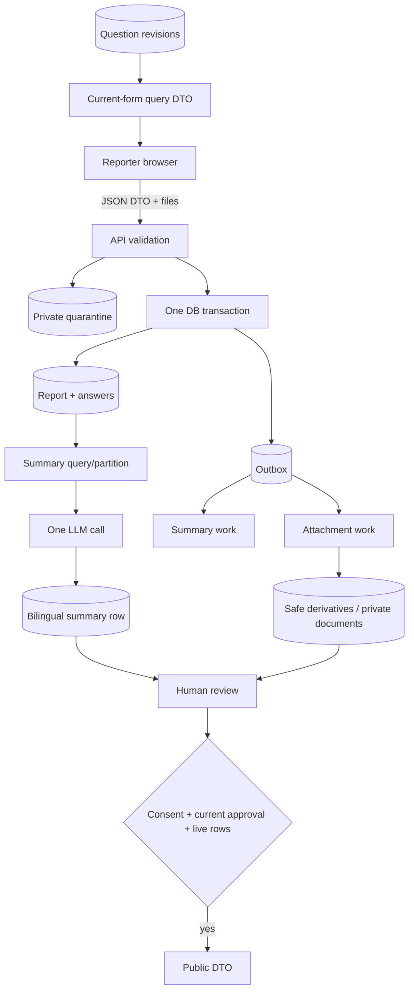

# Interfaces and data flow

## HTTP surface

Resource names are illustrative where implementation has not begun, but the
capability boundaries are normative.

### Public/reporting API

| Method and route | Purpose | Result |
|---|---|---|
| `GET /health` | Service health for platform probes | Minimal health response; no dependency details publicly exposed. |
| `GET /api/v1/questions/current` | Load the ordered current form | Bilingual question-revision DTO, cache validator/version allowed. |
| `POST /api/v1/reports` | Submit final report JSON plus optional attachments | `202` with opaque report ID/status. Turnstile and rate limited. |
| `GET /api/v1/public/reports` | Paginated public feed | Only publishable public DTO fields. |
| `GET /api/v1/public/reports/{id}` | Public detail | Same allowlisted fields for one publishable report, otherwise `404`. |

There are no draft, upload-slot, blob-proxy, public-answer, or publication-
channel endpoints.

### Admin API

| Capability | Authorization |
|---|---|
| Sign in/out and inspect current session | Allowlisted member; login itself is throttled and generic on failure. |
| List review work and read report detail | SafetyOfficer or Administrator. |
| Edit both summary texts; approve/reject/publish/delete a report | SafetyOfficer or Administrator; CSRF protected and audited. |
| Obtain a short-lived attachment URL | SafetyOfficer or Administrator; safe image/video derivatives or validated private document originals only. |
| List/create/delete eligible question revisions | Administrator; every write audited. |
| List/add/change/revoke/delete admin allowlist entries | Administrator; every write audited. |

Admin mutation routes use explicit command DTOs and concurrency tokens where a
stale edit could overwrite another officer's work. Error bodies are localized
problem details with stable machine codes and no secrets/private values.

## Core ports

Keep ports only at real external boundaries:

- a member authenticator for the current HPAC adapter and future standards-based
  adapter;
- a model summarizer accepting the partitioned DTO and returning the strict
  bilingual draft plus provenance;
- a private blob store supporting bounded stream write/read and short-lived
  derivative read access;
- an attachment detector/processor for controlled image/video derivatives and
  document validation;
- a Turnstile verifier; and
- `TimeProvider` for testable expiry, retries, and lifecycle decisions.

Do not keep ports whose only reason was a removed feature: field cipher,
translator, PII auditor, publication channel, email sender, upload-URL slot, or
specialized aircraft processing. A concrete implementation may be used directly
when no domain boundary or second adapter exists.

## Submission-to-review data flow

## Worker coordination

Summarization and each attachment file are separate typed outbox messages with
identifier-only payloads. The Worker deployment registers handlers for both.
A handler loads current database state rather than trusting content in the
message. Work is idempotent: an already completed live summary/file is not
duplicated, and a deleted report is ignored/marked complete without output.

The summary handler builds its DTO at runtime so privacy and labels come from
the immutable revision actually answered. It makes one provider call per
attempt and commits the pair plus message completion coherently. Attachment
handlers operate on one server-minted key, expose only verified image/video
derivatives or validated private document originals, and never extract
documents into the summary flow.

## Logging and telemetry boundary

Structured logs may contain request correlation ID, opaque report/work IDs,
route, result code, duration, attempt number, safe attachment type, and stable error
code. They must not contain DTO bodies, answers, question copy when it embeds
answers, private context, model prompts/responses, credentials, session/CSRF/
Turnstile tokens, IP addresses beyond ephemeral security processing, client
filenames, or object URLs.

Metrics aggregate counts and latency. Alerts identify stuck/failed work by
opaque ID so authorized operators can investigate in the application.
