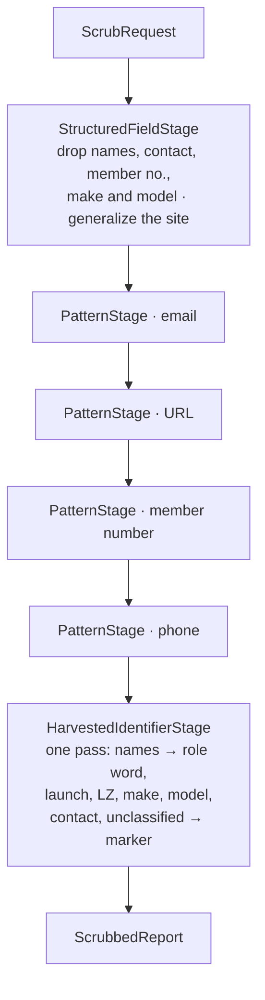

# Anonymization

**Stage 1 of the anonymization pipeline: the deterministic scrub.** No AI, no
network, no database, no configuration. It runs before any model sees a report,
because nothing should ask a language model to remove what a regular expression
removes reliably.

This is the most important code in the repository. Everything downstream —
summarization, the PII audit, translation, human review — is a second chance.
This is the first one, and it is the only stage whose behaviour is fully
determined.

## What it owns

- `DeterministicScrub` — the entry point, and the only public way to run stage 1.
- `ScrubRequest` / `ScrubField` / `ScrubFieldKind` — a report presented for
  scrubbing.
- `ScrubbedReport` — what survives, and the text stage 2 summarizes.
- `ScrubVocabulary` — the role words a name is replaced with, per language.
- `ScrubMarker` — what is left where something was taken out.
- `Stages/` — the chain links, all `internal`.

## What it deliberately does not own

- **Classifying an aircraft.** The published certification class comes from the
  reporter's own answer through `IAircraftClassifier`. This code discards the
  manufacturer and model from the text; it never reads them to infer anything.
  See `docs/aircraft-classification.md`.
- **Deciding a field's sensitivity tier.** That is a property of the question —
  see `docs/data-handling.md`. `ScrubFieldKind` describes the *handling* a field
  needs, which is a different question: a launch and a manufacturer are both
  Internal, and one is generalized while the other is discarded.
- **Mapping a `Report` onto a `ScrubRequest`.** The worker does that, because it
  is the thing that knows about question roles and persistence.
- **Judging the result.** Stages 3 and 5 audit the generated summary. They flag;
  they never rewrite.

## The chain

The stages are a **chain of responsibility**, assembled in `DeterministicScrub`
and nowhere else. Order is load bearing.

Why that order:

- **Structured first**, because those answers are also the best token list there
  is. The reporter told us the pilot's name and the launch's name, so nothing has
  to guess when the same words appear in the narrative.
- **Email before URL**, so a host name inside an address is not taken first and
  the address left half-standing.
- **Email and URL before names**, so `sarah.whitlock@example.ca` is removed as an
  address rather than rewritten into `the pilot.the pilot@example.ca`.
- **Member number before phone**, so the phone rule cannot claim its digits.
- **Everything harvested last, in a single pass.** One alternation, longest
  branch first, because two stages each looping their tokens let a later token
  match inside text an earlier one had just written — a reporter surnamed
  "Pilot" turned "the pilot" into "the the reporter".

The chain is **closed**. `ScrubStage` and every stage are `internal` and there is
no way to construct a scrub with a stage missing, no options object, and no
callback. Anonymization is an invariant of this system, not a policy a caller
configures — see AGENTS.md, "the invariants above are deliberately closed".

## Five rules worth knowing before you change anything

**A name becomes a role word, not a placeholder.** "the pilot" / "le pilote",
"the reporter" / "le déclarant", chosen from the structured field the name was
given in. The scrubbed text still reads as prose, so stage 2 is summarizing a
sentence rather than a fragment. If the reporter *is* the pilot, one role word
covers both.

**The French role words are always masculine, whoever was flying.** Do not "fix"
the agreement. French forces an article where English does not, and "la pilote"
in a fifty-person flying community narrows the field considerably — agreeing it
would put back the fact the scrub had just removed. `FrenchNarrativeTests` fails
if you change it. See
[ADR-0028](../../../../docs/decisions/ADR-0028-role-words-in-place-of-names.md).

**The region a site is generalized to is the province, and nothing finer.** It
comes from the reporter's own structured province answer. The scrub never derives
a province from a site name — that would be inferring a location rather than
reading one. With no province answered, the location field is dropped outright.

**Matching is forgiving about the form of the same word.** Accent- and
case-insensitive; tolerant of a trailing "s", so "the Whitlocks" goes the way of
"Whitlock's"; either Unicode normalization form, since a browser may send "é" as
one code point or two; and whitespace may move, so "Halcyon 3" finds "Halcyon3".
Names also split on hyphens and apostrophes. "Renée" in the name field is found as "Renee" in the
narrative and the other way round; "Sarah-Jane" is found as "Sarah". Sub-tokens
below three characters (names) or four (places and aircraft) are not matched on
their own, so a French narrative keeps its "de" and "la" and a flying report
keeps the word "air".

**The precise date and time never survive.** The reporter submits an actual date
and clock time; the scrub publishes month and year, and a `TimeOfDay` bucket. A
precise time plus a province plus an aircraft type is another aggregation that
names one person.

**The bucket boundaries are not here, on purpose.** Stage 1 is handed the bucket
the way it is handed the province, and owns the invariant rather than the
arithmetic — whatever the field said, only the bucket survives. The single
definition of "morning" arrives with the schema work in
[PR #62](https://github.com/HPAC-Safety/safety-report/pull/62); it is not on this
branch. Do not copy it here when it lands. `Unknown` (asked, unanswered) is published; `NotAnswered` (no such
question) drops the field; midnight is neither and buckets as morning.

**A field nobody classified is dropped**, and its value is removed from the
narrative too. `ScrubFieldKind.Unclassified` is the
zero value and it means "drop", the same way an unclassified question is
Restricted. Keeping a field is a decision somebody has to make — `FreeText` for
an ordinary answer, `Narrative` for the account itself.

## What it cannot do, on purpose

Stage 1 finds an identifier when it matches a pattern or when the reporter also
typed it into a structured answer. A launch — or a social handle, or a mailing
address — that appears **only** in the narrative and nowhere in the structured
answers is not something a regular expression can recognise, and no amount of
tuning changes that. Nothing pattern-matches `@sarahflies`. Nor does the
narrowing reach a date or time the reporter typed into the narrative — that
applies to the structured answers, and free text keeps its numbers so it keeps
its altitudes.

**Stage 1 does not de-gender the reporter's own prose, and must not try.** "She
broke her ankle", "elle s'est posée" survive exactly as written. Rewriting
grammar means understanding the sentence, which is what a deterministic stage
must not attempt; stage 2 rewrites and stage 3 flags. What stage 1 guarantees is
that the words *it* writes never encode gender. See ADR-0028. That gap is why
stages 3 and 5 exist and why a human approves every publication. Do not close it
by inventing a list of Canadian site names here.

Over-redaction is the accepted failure mode in both directions: the phone rule
will occasionally take a ten-digit number that was not a phone, and the URL rule
will occasionally take a typo with no space after a full stop. A vague summary
is recoverable; an identified pilot is not.

## How it is exercised

`tests/HpacSafety.Anonymization.Tests` — the golden-file suite, one case per
category of identifier plus a case combining all of them. Every assertion is the
**absence of a specific token**, never an exact output sentence. It runs with no
database, no network, and no model, and `CoreDependencyTests` fails the day
`HpacSafety.Core` grows a package reference, because that is the constraint that
keeps the suite provable.

**Never commit real report content as a fixture.** Every name, number, site, and
brand in that suite is invented.

## Related

- [ADR-0003](../../../../docs/decisions/ADR-0003-anonymization-pipeline.md) — the five stages
- [ADR-0027](../../../../docs/decisions/ADR-0027-deterministic-scrub-design.md) — how this stage is built
- [ADR-0028](../../../../docs/decisions/ADR-0028-role-words-in-place-of-names.md) — role words
- `docs/anonymization-policy.md`, `docs/data-handling.md`
- `prompts/redaction-rules.v2.md` — the same rules, addressed to the model
