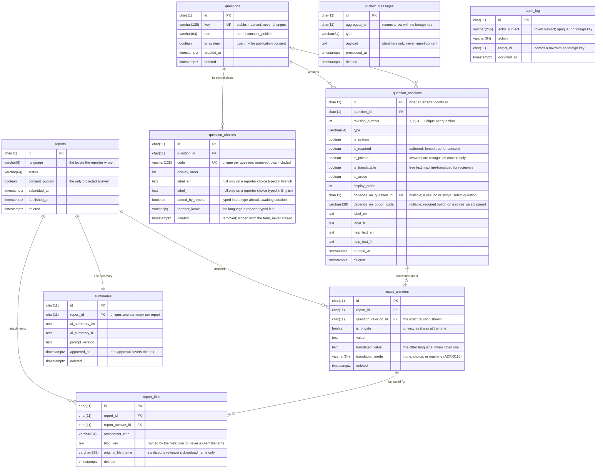

# The HPAC Safety database

One PostgreSQL database, one `DbContext`
([`HpacSafetyDbContext`](../HpacSafetyDbContext.cs)), and one way to change the
schema: an EF Core migration in this folder. There is no second context for a
"worker schema" or a "reporting schema," and no hand-written DDL anywhere ([ADR-0055](../../../../docs/decisions/ADR-0055-ef-core-migrations-sql-files-stored-procedures.md)).

This file describes the database. The target *design* lives in
[`docs/data-and-persistence.md`](../../../../docs/data-and-persistence.md) and
[`/features`](../../../../features/README.md); where they disagree with this
page, they win and this page is stale.

## Four conventions, applied everywhere

**Every key is an eleven-character tiny id.** `char(11)` over
`A-Za-z0-9-_`, case-sensitive, cryptographically random. One column type in
every table, so there are no mixed-type joins, and — the actual reason — an
identifier encodes no creation time and cannot be enumerated. A report id ends
up in URLs, blob keys, and logs, and this system narrows a published occurrence
to a month and a year on purpose; a UUIDv7 would hand the timestamp back ([ADR-0034](../../../../docs/decisions/ADR-0034-tiny-ids.md)).

**Nothing is physically deleted.** Every table except `audit_log` carries
`deleted timestamptz null` and a default query filter limiting reads to live
rows, applied by
[`SoftDeleteFilters`](../Conventions/SoftDeleteFilters.cs). `audit_log` is
append-only and has no such column. A reference check that must see deleted
rows — "has any answer, on any report including deleted ones, used this
revision?" — uses `IgnoreQueryFilters` explicitly.

**Names are `snake_case` in the database and PascalCase in C#**, translated by
[`SnakeCaseNames`](../Conventions/SnakeCaseNames.cs) last in
`OnModelCreating`, so anything named explicitly keeps the name it was given.

**Enums are stored as invariant codes, never integers** — `long_text`, not
`1` — via [`EnumCodeConverter`](../Conversions/EnumCodeConverter.cs), with a
`CHECK` constraint listing the valid codes. A row is readable in `psql` without
the enum beside it, and reordering an enum member cannot silently reinterpret
history.

Dates and times follow
[ADR-0035](../../../../docs/decisions/ADR-0035-dateonly-datetimeoffset-timeonly-datetime-is-banned.md):
`DateOnly` when the time does not matter, `TimeOnly` when the date does not,
`DateTimeOffset` for an instant. `DateTime` is banned and the build enforces it.

## The schema



The columns above are the ones worth knowing to read the schema, not every
column in it. The generated migrations are exhaustive; this is a map.

### What the shape is protecting

**A question is not a row — it is a chain of complete revisions.**
`questions` holds only what never changes: the stable key, whether it is the
system question, and its role. Everything a reporter could see — wording, type,
order, section, privacy, required state, and conditionality — lives on
`question_revisions`, and an edit inserts a new one rather than updating the
old. `report_answers` points at a revision, never at a question, so
a report filed two years ago still renders exactly what it asked ([ADR-0016](../../../../docs/decisions/ADR-0016-data-driven-question-bank.md)).

**Choices belong to the question, not to a revision.** `question_choices` is
edited in place: adding, rewording, reordering, or removing a choice creates no
revision and never forks the question, because an answer stores the reporter's
own words rather than a reference to a choice. A removed choice keeps its row
with `deleted` stamped, and is loaded with its question — the one table without
the live-row filter — because a fork copies it and a reporter must not revive
it. A type-ahead's reporter-added choice may hold one language until an
administrator supplies the other ([ADR-0095](../../../../docs/decisions/ADR-0095-a-question-owns-its-choices-outside-its-revisions.md)).

**One rule is deliberately not in the database.** "A conditional question's
parent must be a `yes_no` question" depends on the parent's *current* revision —
a different row — so a `CHECK` cannot express it and a trigger would hide a
domain rule from everyone reading the C#. It is enforced in
`QuestionDependencies` and at the API instead ([ADR-0060](../../../../docs/decisions/ADR-0060-conditional-questions-depend-on-a-boolean-question.md)).

**`outbox_messages.aggregate_id` and `audit_log.target_id` have no foreign
key**, on purpose: each names more than one kind of row. Because EF cannot fix
those up, `HpacSafetyDbContext` rewrites them explicitly when a tiny-id
collision forces a retry.

## Who applies a migration

The application does, at startup, and no deploy job exists for it. Both the API
and the Worker call `HpacSafetyDbContext.EnsureMigratedAsync`, which takes a
PostgreSQL advisory lock, re-checks for pending migrations *after* acquiring it,
and applies them only if any remain. Whichever process starts first after a
deploy does the work; the other blocks briefly and finds nothing to do. That is
what makes "the Worker booted before the API" safe by construction rather than
by deployment ordering ([ADR-0055](../../../../docs/decisions/ADR-0055-ef-core-migrations-sql-files-stored-procedures.md)).

## Adding a migration

See [`skills/manage-hpac-migrations`](../../../../skills/manage-hpac-migrations/SKILL.md)
for the rules a migration has to satisfy before it is reviewable. The command:

```sh
dotnet ef migrations add <Name> \
  --project src/HpacSafety.Infrastructure \
  --startup-project src/HpacSafety.Infrastructure \
  --output-dir Persistence/Migrations
```

`HpacSafety.Api` is not usable as the startup project — it does not reference
`Microsoft.EntityFrameworkCore.Design`. `HpacSafety.Infrastructure` supplies
[`HpacSafetyDbContextFactory`](../HpacSafetyDbContextFactory.cs) for exactly
this.

## The migrations, in order

| Migration                                              | What it did                                                                                                                                                                                                                                                                                                                                                                                                                                       |
|--------------------------------------------------------|---------------------------------------------------------------------------------------------------------------------------------------------------------------------------------------------------------------------------------------------------------------------------------------------------------------------------------------------------------------------------------------------------------------------------------------------------|
| `20260823001528_InitialSchema`                         | The first schema: questions, reports, answers, files, summaries, admin users, audit log, outbox.                                                                                                                                                                                                                                                                                                                                                  |
| `20260823022839_ReplaceSensitivityWithQuestionPrivacy` | Replaced a three-tier sensitivity field with the private/eligible split the model actually needs (ADR-0038).                                                                                                                                                                                                                                                                                                                                      |
| `20260827013637_MigrateCanonicalDomainAndPersistence`  | Moved to complete immutable revisions, removed the application-side field cipher, and reached the current baseline (ADR-0040).                                                                                                                                                                                                                                                                                                                    |
| `20260921021720_AddQuestionAuthoring`                  | Added `option_sets`/`option_set_items`, the conditional-question and option-set provenance columns, and the `time` and `autocomplete` question types.                                                                                                                                                                                                                                                                                             |
| `20260921034154_AddReporterAddedChoices`               | Added `option_set_items.added_by_reporter` and an index on `(option_set_id, added_by_reporter)`, which is the curation query.                                                                                                                                                                                                                                                                                                                     |
| `20260921152356_DropAdminUsersForJwtIdentity`          | Dropped `admin_users` and renamed/widened its two referencing columns to opaque token subjects — `audit_log.actor_subject` and `summaries.approved_by_subject` (ADR-0065).                                                                                                                                                                                                                                                                        |
| `20260921192412_ForkAnsweredQuestionsAndStringAnswers` | Narrowed the unique index on `questions.key` to live rows so a fork chain can share one (ADR-0071). Replaced `report_answers.selected_option_codes` with `locale`, `translated_value`, and `needs_translation` alongside the existing `value`, dropped the uniqueness of `(report_id, question_id)` so a multi-select records one row per chosen value, indexed the translation queue, and added `option_set_items.needs_translation` (ADR-0072). |
| `20260921205551_RemoveStatementGroupSectionKey`        | Dropped `question_revisions.section_key` after removing the `statement` and `group` question types it existed to support — neither had a built renderer, and nothing distinguished them from each other in code.                                                                                                                                                                                                                                  |
| `20260921224859_AddDependsOnOptionCode`                | Added `question_revisions.depends_on_option_code`, the required option a `single_select` parent must be answered with (ADR-0074). Null for a `yes_no` parent, whose condition stays the invariant "yes".                                                                                                                                                                                                                                          |
| `20260922222239_RecordReporterChoiceLocale`           | Added nullable `option_set_items.reporter_locale`, the language a reporter typed a type-ahead choice in (ADR-0063). Null for every choice an administrator authored, which is every row that already existed. |
| `20260923010810_GiveEachQuestionItsOwnChoices`        | Added `question_choices`, copied every question's current choices onto it (a type-ahead backed by a live shared list takes that list's items, reporter marks and removals kept; a reporter item awaiting its other language keeps only the language typed), then dropped `option_sets`, `option_set_items`, `question_revision_options`, `question_revisions.option_set_id`, and `question_revisions.allows_reporter_additions` (ADR-0095). The copy is `Sql/20260923010810_CopyChoicesOntoQuestions.sql`, the first migration SQL kept in its own file (ADR-0055). |
| `20260923205108_AddReportFileOriginalFileName`        | Added nullable `report_files.original_file_name`, the reporter's sanitized filename, used only as a reviewer's download name (ADR-0097). Null for every file that already existed, which keeps its server-minted download name. |
| `20260923224129_WordAttachmentQuestionForSeveralFiles` | No schema change. Rewords the seeded attachment question for several files, only where it still reads exactly as seeded: an unanswered question gets a new revision, an answered one forks (ADR-0071). An Administrator's own wording is left alone. |
| `20260924143055_TranslateOnlyAnswersThatNeedIt`       | Added `question_revisions.is_translatable` (true for existing long-text revisions, false otherwise, and checked to be false for anything but short or long text) and `report_answers.translation_mode` (`none`, `choice`, or `machine`; existing long-text, select, and type-ahead answers backfilled `machine`, everything else `none`). The awaiting-translation index now covers only `machine` answers (ADR-0110). |

Past migrations are history and are never edited — including the raw SQL
already inlined in them. New raw SQL goes in its own `.sql` file under
[`../Sql/`](../Sql), not as a C# string literal.
