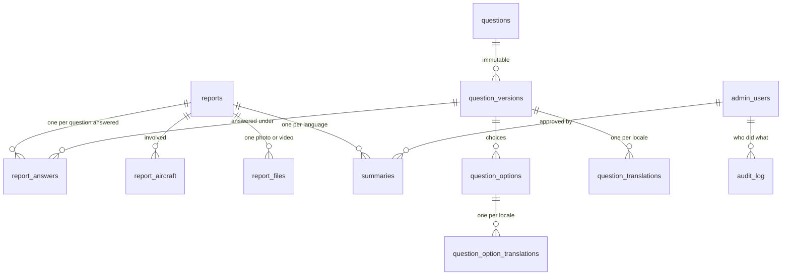
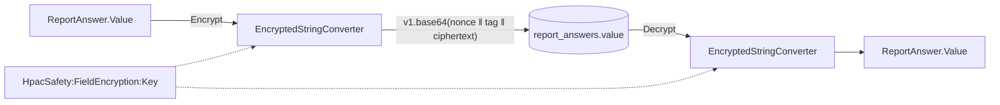

# Persistence

The database: the EF Core model, the migrations, the seeded question bank, and
the application-side encryption of Restricted columns.

**Owns** the schema. Every table in this system is defined here, including
`report_files`, whose blob storage lives elsewhere.

**Does not own** what any of it means. Invariants belong to the aggregates in
`HpacSafety.Core`; this project maps them to columns and nothing more.

## Layout

| Folder | What is in it |
|---|---|
| `Configurations/` | One `IEntityTypeConfiguration` per aggregate — tables, keys, indexes, relationships |
| `Conventions/` | `SnakeCaseNames`, applied last so an explicit name always wins |
| `Conversions/` | `LocaleConverter`, `EnumCodeConverter<T>` — domain values stored as invariant codes |
| `Encryption/` | `AesGcmFieldCipher` and the value converter that binds it to a column |
| `Migrations/` | Scaffolded by `dotnet ef`. Hand-edited only to call a seed writer |
| `Seeding/` | The question bank as data, and the guarded local-administrator insert |

## The tables



`outbox_messages` stands alone, on purpose. It is written in the same
transaction as a report and read by a different process.

Three shapes worth knowing before reading the configurations:

- **An answer references a question _version_**, never the mutable question row.
  Rewording a question tomorrow cannot change what an answer given today appears
  to mean. See [ADR-0016](../../../docs/decisions/ADR-0016-data-driven-question-bank.md).
- **`summaries` holds one row per language**, with `is_source` on the one
  generated from the report and `translated_from_summary_id` on the other. A
  reviewer can always tell which is which, and `model` and `prompt_version` are
  stamped on both so any published text traces back to what produced it.
- **`ix_outbox_messages_claimable` is a partial index** over `next_attempt_at`,
  filtered to rows that are neither processed nor poisoned. Without the filter,
  the claim query reads the whole processed history for the rest of the system's
  life.

## Encryption

`report_answers.value` is encrypted with AES-256-GCM before PostgreSQL sees it,
through `IFieldCipher` — a port declared in `Core`, implemented here, bound to
the column by a value converter.



Three things follow from that, and all three are deliberate:

- The column cannot be searched, sorted, or indexed by value in the database.
- The wrong key throws `FieldDecryptionException`. It never returns plausible
  rubbish.
- Losing the key loses the data. Key custody is an operational responsibility.

`admin_users.member_identifier` is **not** encrypted: it is the lookup key at
sign-in. See [ADR-0019](../../../docs/decisions/ADR-0019-application-side-field-encryption.md).

## Seeding

A clean database asks exactly the question set in `docs/form-spec.md`, **in both
languages** — a form that only works in English is not a working form here, see
`AGENTS.md`, "Both languages are first-class".

The French wording is machine-translated and carries
`is_machine_translated = true`: it renders, and nobody has reviewed it. That is a
queryable column rather than a note, so the admin UI (#49) can list every piece
of unreviewed wording as a work queue, and revising one by hand clears the flag.

The migration also seeds **one obviously-fake local administrator**,
`admin@localhost`, and only where the database applying the migration has opted
in:

```
Options=-c hpac.seed_development_admin=true
```

Unset means no, which is what production is. The real safety-officer allowlist
is a later issue and will never be a migration. See
[ADR-0020](../../../docs/decisions/ADR-0020-seeding-by-migration.md).

## Working on it

```bash
# Scaffold a migration. This project is both the migrations project and the
# startup project — HpacSafetyDbContextFactory means no application has to boot.
dotnet ef migrations add <Name> \
  -p src/HpacSafety.Infrastructure -s src/HpacSafety.Infrastructure \
  -o Persistence/Migrations

# Apply it. HPAC_SAFETY_CONNECTION overrides the local default.
dotnet ef database update \
  -p src/HpacSafety.Infrastructure -s src/HpacSafety.Infrastructure
```

Exercised by `tests/HpacSafety.Infrastructure.Tests`, which starts a real
`postgres:17-alpine` through Testcontainers and applies every migration to a
fresh database per test.

## Related

- [`docs/data-handling.md`](../../../docs/data-handling.md)
- [`docs/architecture.md`](../../../docs/architecture.md)
- [ADR-0002](../../../docs/decisions/ADR-0002-transactional-outbox.md),
  [ADR-0016](../../../docs/decisions/ADR-0016-data-driven-question-bank.md),
  [ADR-0019](../../../docs/decisions/ADR-0019-application-side-field-encryption.md),
  [ADR-0020](../../../docs/decisions/ADR-0020-seeding-by-migration.md)
