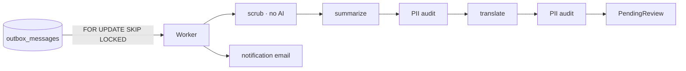

# HpacSafety.Worker

The outbox consumer. **Deployable.**

Everything slow or failure-prone that happens *after* the API has already
accepted a report.

## Why it is a separate process

A pilot filing a report after a crash gets an immediate acknowledgement.
Summarization takes seconds, calls a third-party model, and fails in ways an
HTTP request should not have to care about.

Splitting it means:

- **Submission never fails because Anthropic is down.** Model latency is
  seconds; an outage is longer. Neither reaches the reporter.
- **Work survives a restart.** The queue is a database table, not in-memory
  state. Deploy mid-summarization and it resumes.
- **Summarization can be stopped entirely** while the system still *receives*
  reports — the part that must never be down.

## What it does



Claims work with `SELECT ... FOR UPDATE SKIP LOCKED`, so more than one instance
can run without coordination. Failures back off exponentially and move aside
after a poison threshold rather than retrying forever — a report that cannot be
summarized lands in `SummaryFailed` in front of a human, never nowhere.

## Running locally

```bash
docker compose up -d db
dotnet run --project src/HpacSafety.Worker
```

Without an Anthropic key it runs against recorded fixtures. Email defaults to a
logging sender, and `Notifications:Enabled` is `false` in Development with **no**
default recipient — a misconfigured dev environment cannot mail
`safety@hpac.ca`.

## Deployment

```bash
dotnet publish src/HpacSafety.Worker -c Release /t:PublishContainer
```

Deploy as a long-running service alongside the API — **not** as a scheduled job
or a serverless function. It polls continuously and holds database connections.

**Instances:** one is enough. `SKIP LOCKED` makes more than one safe if you want
redundancy; there is no leader election to configure.

**Required configuration:**

| Variable | Notes |
|---|---|
| `ConnectionStrings__Default` | Same database as the API |
| `Anthropic__ApiKey` | Summarization, audit, translation |
| `Notifications__To` | `safety@hpac.ca` in production; a developer's own address locally |
| `Notifications__Enabled` | `true` in production |
| `Email__*` | SES or SMTP settings |

**Scale to zero is acceptable** if the platform supports a warm restart — work
is durable in the outbox. Do not run it behind a load balancer; it serves no
traffic.

**Health:** a `SummaryFailed` count above zero, or outbox rows older than a few
minutes with `processed_at` null, is the signal that something is wrong. Alert
on those rather than on process liveness.

## Related

- [`docs/architecture.md`](../../docs/architecture.md)
- [`prompts/README.md`](../../prompts/README.md) — the runtime prompts it loads
- [`docs/anonymization-policy.md`](../../docs/anonymization-policy.md)
